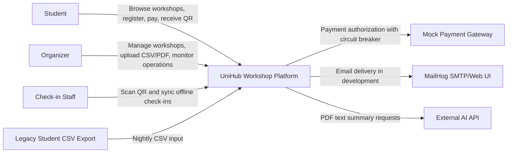
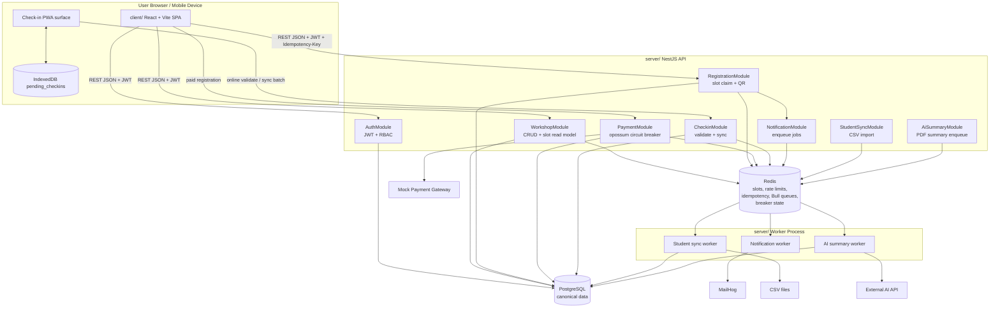
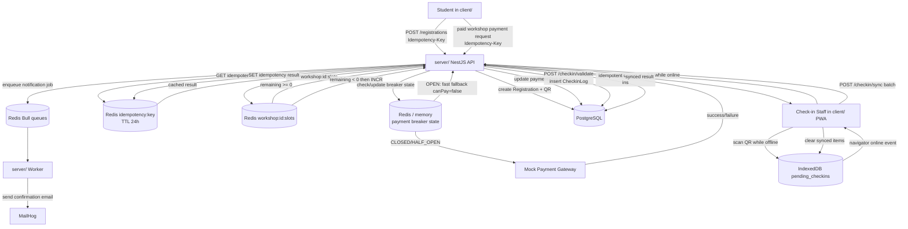

# UniHub Workshop - Technical Design

## Overall Architecture

The system uses a **Modular Monolith** with separate **Async Worker Processes**.

- **Client**: `client/` is a React + Vite SPA for students and organizers, and also provides the check-in PWA surface for event staff.
- **Server API**: `server/` is a NestJS REST API split by business modules: Auth, Workshop, Registration, Payment, Checkin, Notification, Student Sync, and AI Summary.
- **Message Broker & Cache**: Redis supports high-traffic coordination: slot counters, rate limiting, idempotency, circuit-breaker state, and Bull Queue jobs.
- **Reasoning**: A modular monolith keeps delivery fast for a small team while Redis and workers move high-contention or slow operations out of the direct PostgreSQL request path.

## C4 Diagram

### Level 1 - System Context

UniHub is the single platform for workshop discovery, registration, payment fallback, QR check-in, and operational workflows. Users access it through `client/`; integrations and persistence are coordinated by `server/`.

### Level 2 - Container

`server/` remains the HTTP modular monolith. Background work runs in worker processes that use Redis-backed Bull queues. PostgreSQL is the source of truth; Redis is used for volatile coordination and read-side counters.

## High-Level Architecture Diagram

Registration is the strongest consistency path: the API checks the idempotency cache before touching slot state, uses Redis `DECR` as the atomic slot claim, writes the confirmed registration and QR to PostgreSQL, then stores the response for safe retries. If `DECR` returns a negative value, the API compensates with `INCR` and returns `409`.

Payment is isolated from free registration. Paid flows use the same idempotency concept, but calls to the mock gateway pass through an `opossum` circuit breaker; when the breaker is open, the API returns a graceful fallback instead of retrying the gateway.

Check-in supports both immediate and delayed writes. Online scans call `POST /checkin/validate`; offline scans are held in IndexedDB and later uploaded to `POST /checkin/sync`, which must be idempotent so repeated batches do not create duplicate `CheckinLog` rows.

## Database Design

PostgreSQL stores canonical data: `User`, `Workshop`, `Registration`, `CheckinLog`, and `StudentSyncLog`. Redis stores transient coordination state: workshop slot counters, idempotency responses, rate-limit buckets, circuit-breaker state, and Bull queues. Slot availability shown in the UI may be slightly stale; actual registration writes are protected by Redis `DECR` and database uniqueness constraints.

## Access Control Design

Authentication uses JWT issued by `server/src/modules/auth`. Protected endpoints use `JwtAuthGuard` plus `@Roles()` metadata checked by `RolesGuard`. The fixed roles are `STUDENT`, `ORGANIZER`, and `CHECKIN_STAFF`; organizer-only routes manage workshops/imports/summaries, while check-in routes require `CHECKIN_STAFF`.

## System Protection Design

### Traffic Spike Control

Use Redis-backed token buckets through `@nestjs/throttler`. Sensitive write paths such as `POST /registrations` get stricter limits than workshop browsing. When a bucket is exhausted, the API returns HTTP 429 with `Retry-After`.

### Payment Gateway Instability

Payment calls go through an `opossum` circuit breaker around the mock gateway. The target behavior is closed by default, open when failures exceed 50%, and half-open after 30 seconds. Open state returns `{ canPay: false }` quickly so workshop browsing and free registration remain available.

### Double Charge / Duplicate Registration Prevention

Registration and payment requests require an `Idempotency-Key` header. The API stores completed responses in Redis for 24 hours; a repeated key returns the saved response without re-claiming a slot or re-calling the payment gateway.

## Architecture Decision Records

- **Modular monolith over microservices**: faster delivery for a two-person team, while keeping domain boundaries in NestJS modules.
- **PostgreSQL as system of record**: strong relational constraints for users, workshops, registrations, and check-ins.
- **Redis for coordination, not canonical data**: low-latency counters and queues without making Redis the source of truth.
- **Bull Queue for slow work**: email, CSV sync, and AI summary jobs must not block user-facing API responses.
- **IndexedDB for offline check-in**: browser-local durable storage survives refreshes and temporary network loss.
