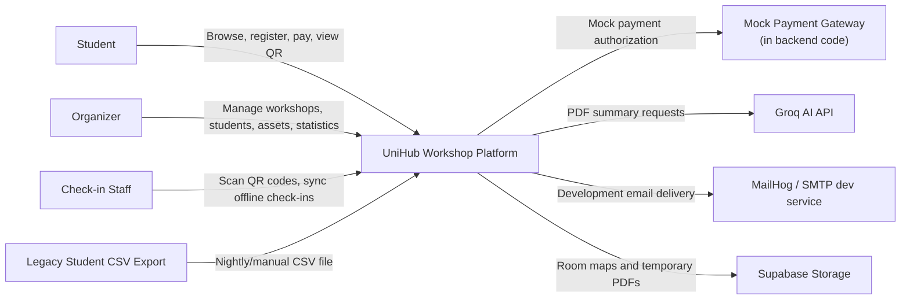
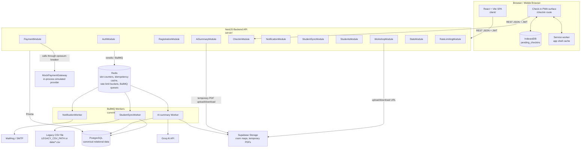
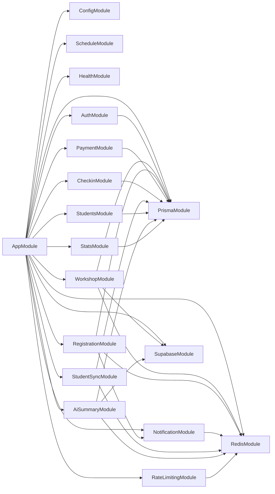
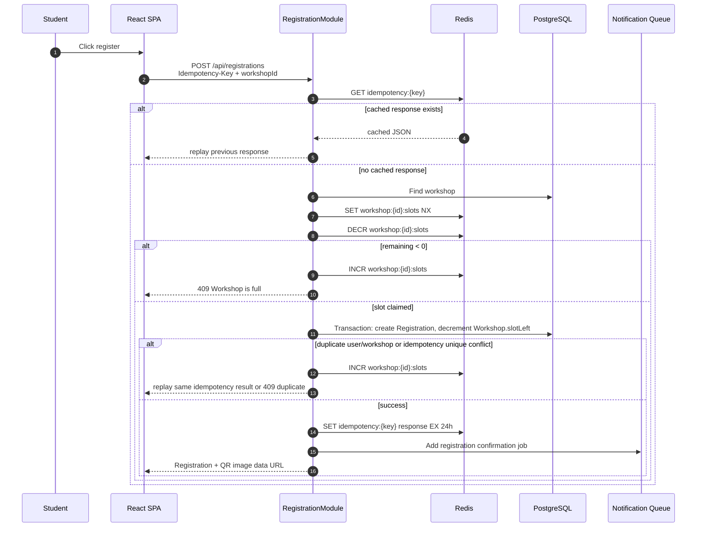
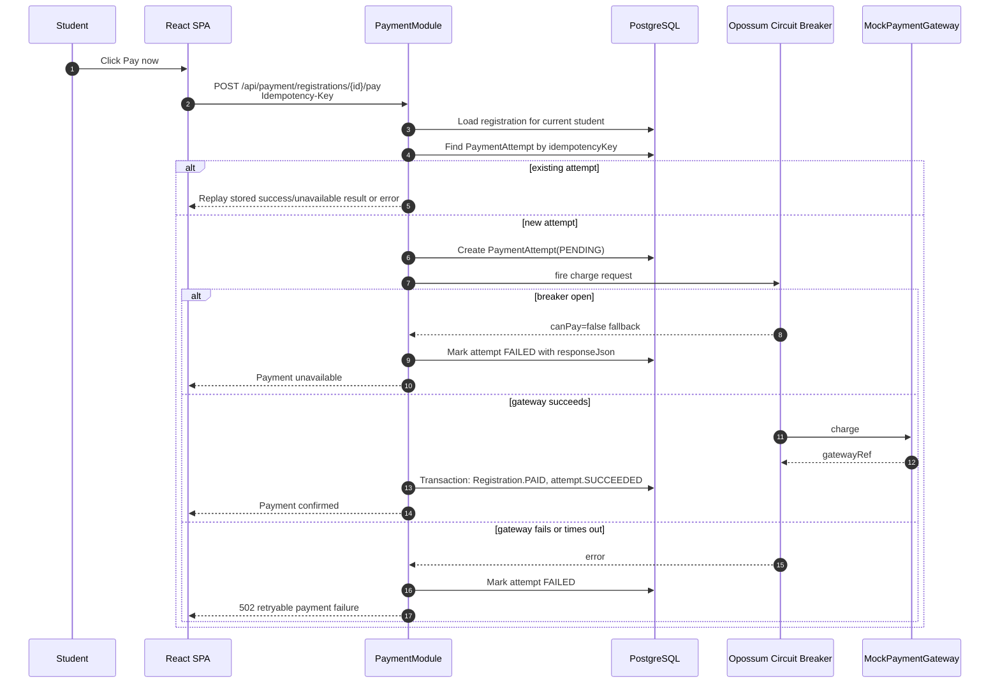
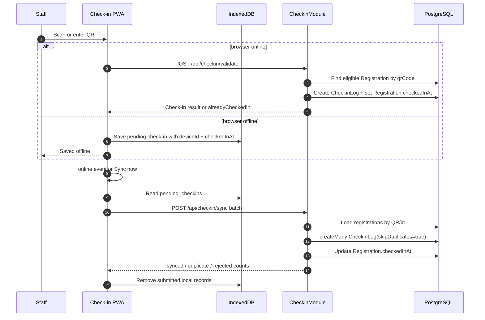
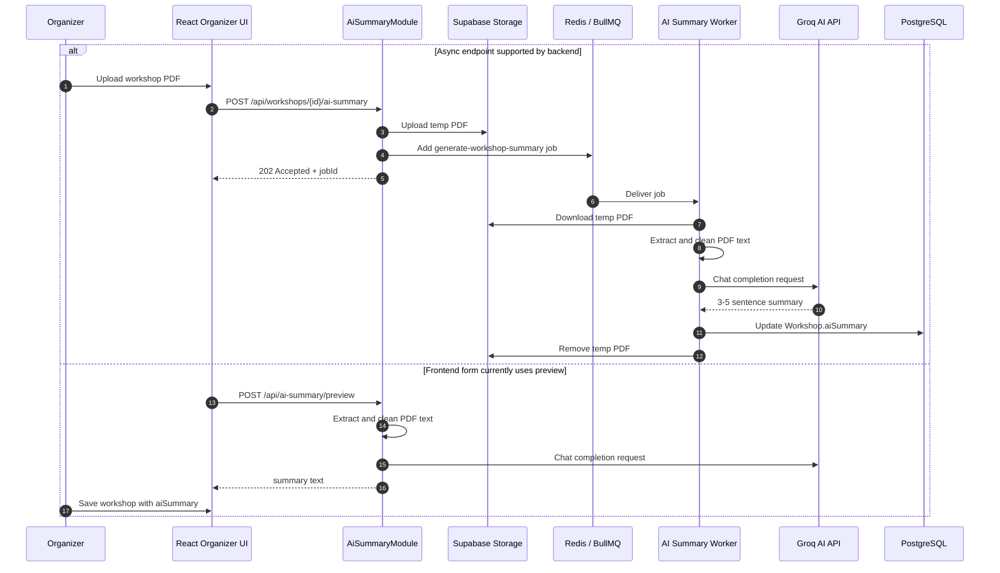
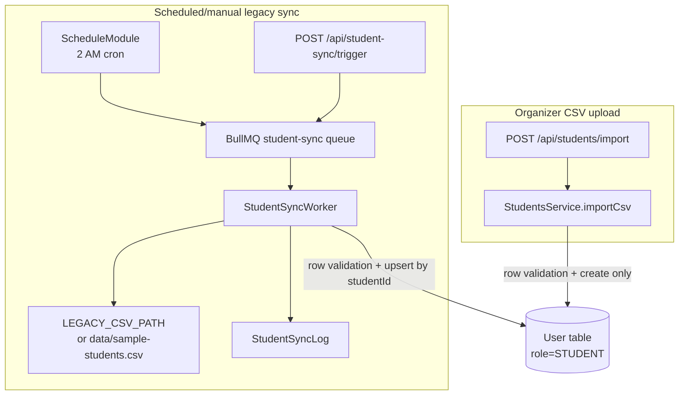
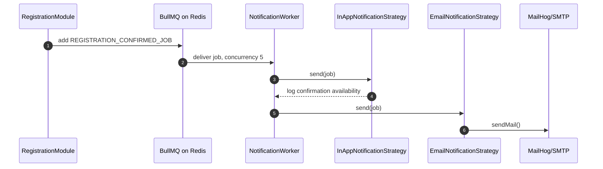

# UniHub Workshop - Architecture Design

## 1. Overview

UniHub is a university workshop and event management platform for three roles:

- `STUDENT`: browse workshops, register, pay for paid workshops, receive QR codes.
- `ORGANIZER`: manage workshops, room maps, AI summaries, student data, sync logs, and statistics.
- `CHECKIN_STAFF`: scan QR codes and sync offline check-ins.

The implementation is a **modular monolith**:

- Frontend: React + Vite single-page app, with a PWA-capable check-in surface.
- Backend: NestJS API with modules grouped by business capability.
- Database: PostgreSQL accessed through Prisma.
- Coordination layer: Redis for workshop slot counters, registration idempotency cache, rate limiting, and BullMQ queues.
- Async jobs: BullMQ workers for notifications and student sync; AI summary uses a BullMQ queue/worker created by `AiSummaryService`.
- File storage: Supabase Storage for room maps and temporary AI summary PDFs.
- External integrations: Groq AI API, MailHog/SMTP in development, and an in-code mock payment gateway.

Important implementation note: the current backend runs BullMQ workers inside the NestJS app process. The design can be split into independent worker processes later, but the current codebase does not include a separate worker entrypoint or package script.

## 2. Implementation Snapshot

| Area | Current implementation |
|---|---|
| Authentication | `POST /api/auth/login`, `POST /api/auth/refresh`, `POST /api/auth/logout`; JWT access token and opaque refresh token records in PostgreSQL. |
| RBAC | `JwtAuthGuard` + `RolesGuard` protect organizer, student, and check-in endpoints. |
| Workshop management | Organizer CRUD/status update, public listing, Redis-hydrated `slotLeft`, Supabase room-map upload. |
| Registration | Student registration with required `Idempotency-Key`, Redis `DECR` slot claim, PostgreSQL transaction, QR payload, notification job. |
| Payment | Mock gateway, `PaymentAttempt` table, payment idempotency through unique keys, in-memory `opossum` circuit breaker. |
| Check-in | Online QR validation and offline batch sync; `CheckinLog.registrationId` is unique to prevent duplicate check-ins. |
| Student data | Synchronous CSV import through `/api/students/import`; scheduled/manual legacy CSV sync through BullMQ and `StudentSyncLog`. |
| Notifications | BullMQ queue with in-app log strategy and SMTP email strategy. MailHog is provided by Docker Compose. |
| AI summary | Backend supports async `POST /api/workshops/:id/ai-summary`; frontend workshop form currently uses sync preview endpoint `POST /api/ai-summary/preview`. Both call Groq after PDF text extraction. |
| Rate limiting | Global Redis-backed throttling; specific policies for registration writes and workshop reads. |
| Infrastructure | `docker-compose.yml` starts PostgreSQL, Redis, and MailHog. Supabase and Groq are external env-configured services. |

## 3. C4 Architecture

### 3.1 C4 Level 1 - System Context



UniHub owns the business workflow: authentication, workshop publication, registration, payment state, QR check-in, student import, and operational statistics. External systems are used only for specialized capabilities: SMTP email capture, AI summarization, object storage, and simulated payment behavior.

### 3.2 C4 Level 2 - Container Diagram



### 3.3 Backend Module Diagram



Module responsibilities:

| Module | Responsibility |
|---|---|
| `AuthModule` | Login, refresh token rotation, logout, JWT strategy. |
| `WorkshopModule` | Workshop listing/CRUD/status, Redis slot read model, Supabase room-map uploads. |
| `RegistrationModule` | Student registration, Redis slot claim, registration idempotency cache, QR generation, notification enqueue. |
| `PaymentModule` | Paid-registration payment, `PaymentAttempt` idempotency, mock gateway, circuit breaker. |
| `CheckinModule` | QR validation and batch sync into `CheckinLog`. |
| `NotificationModule` | BullMQ notification queue, email and in-app notification strategies. |
| `StudentSyncModule` | Nightly/manual legacy CSV sync using BullMQ, writes `StudentSyncLog`. |
| `StudentsModule` | Organizer student list/detail and synchronous CSV import. |
| `AiSummaryModule` | PDF validation/extraction, Groq summary calls, async queue endpoint, preview endpoint. |
| `StatsModule` | Organizer overview counts and capacity summary. |
| `RateLimitingModule` | Redis-backed token-bucket style throttling through NestJS throttler storage. |
| `PrismaModule`, `RedisModule`, `SupabaseModule` | Infrastructure adapters. |

## 4. System Architecture

### 4.1 Data Ownership

PostgreSQL is the canonical source of truth:

- users, roles, password hashes, refresh tokens;
- workshops, schedules, room map URLs, AI summaries, capacity fields;
- registrations, QR payloads, checked-in timestamp, payment state;
- payment attempts and replayable payment results;
- check-in logs and student sync logs.

Redis is not canonical business storage. It is used for:

- `workshop:{id}:slots`: fast atomic remaining-seat counter.
- `idempotency:{key}`: cached registration response with 24-hour TTL.
- rate-limit buckets through custom Redis throttler storage.
- BullMQ queue data for notifications and student sync.
- AI summary queue data created directly with BullMQ.

Supabase Storage is responsible for uploaded binary files:

- room-map files uploaded through `POST /api/workshops/:id/room-map`;
- temporary AI summary PDFs uploaded before async processing.

### 4.2 Endpoint Surface

| Endpoint | Role | Notes |
|---|---|---|
| `POST /api/auth/login` | Public | Returns access token, refresh token, and safe user object. |
| `POST /api/auth/refresh` | Public | Rotates refresh token in PostgreSQL. |
| `POST /api/auth/logout` | Public | Revokes refresh token if valid. |
| `GET /api/workshops` | Public | Open workshops only; rate-limited. |
| `GET /api/workshops/:id` | Public | Hidden for draft workshops. |
| `GET /api/workshops/admin` | `ORGANIZER` | Full organizer list. |
| `POST /api/workshops` | `ORGANIZER` | Creates workshop and initializes Redis slot counter. |
| `PATCH /api/workshops/:id` | `ORGANIZER` | Updates workshop; updates Redis slot counter when capacity changes. |
| `PATCH /api/workshops/:id/status` | `ORGANIZER` | Changes status; cancelled workshops cannot be reopened. |
| `POST /api/workshops/:id/room-map` | `ORGANIZER` | Uploads validated image/PDF to Supabase. |
| `GET /api/registrations/me` | `STUDENT` | Lists current user's registrations. |
| `POST /api/registrations` | `STUDENT` | Requires `Idempotency-Key`; uses Redis `DECR`. |
| `GET /api/payment/status` | Public | Exposes payment breaker availability. |
| `POST /api/payment/registrations/:registrationId/pay` | `STUDENT` | Requires `Idempotency-Key`; creates/replays `PaymentAttempt`. |
| `POST /api/checkin/validate` | `CHECKIN_STAFF` | Online QR check-in. |
| `POST /api/checkin/sync` | `CHECKIN_STAFF` | Batch offline check-in sync. |
| `GET /api/students` | `ORGANIZER` | Student list/search. |
| `GET /api/students/:id` | `ORGANIZER` | Student detail. |
| `POST /api/students/import` | `ORGANIZER` | Synchronous CSV upload/import. |
| `GET /api/student-sync` | `ORGANIZER` | Legacy sync logs. |
| `POST /api/student-sync/trigger` | `ORGANIZER` | Enqueues manual legacy CSV sync. |
| `POST /api/workshops/:workshopId/ai-summary` | `ORGANIZER` | Async PDF summary job; returns `202 Accepted`. |
| `POST /api/ai-summary/preview` | `ORGANIZER` | Synchronous PDF summary preview. |
| `GET /api/stats/overview` | `ORGANIZER` | Overview counts and capacity. |

## 5. Database Schema

### 5.1 Prisma Model Relationship Diagram

```mermaid
erDiagram
  User ||--o{ RefreshToken : owns
  User ||--o{ Registration : creates
  User ||--o{ CheckinLog : performs
  Workshop ||--o{ Registration : has
  Registration ||--o{ PaymentAttempt : has
  Registration ||--o| CheckinLog : checked_in_by

  User {
    string id PK
    string studentId UK "nullable"
    string email UK
    string name
    string passwordHash "nullable"
    Role role
    datetime createdAt
  }

  RefreshToken {
    string id PK
    string userId FK
    string tokenHash
    datetime expiresAt
    datetime revokedAt "nullable"
    datetime createdAt
  }

  Workshop {
    string id PK
    string title
    string description
    string speaker
    string room
    string roomMapUrl "nullable"
    datetime startTime
    datetime endTime
    int totalSlots
    int slotLeft
    WorkshopStatus status
    boolean isPaid
    int price
    string aiSummary "nullable"
    datetime createdAt
  }

  Registration {
    string id PK
    string userId FK
    string workshopId FK
    RegistrationStatus status
    PaymentStatus paymentStatus
    string qrCode UK "nullable"
    string idempotencyKey UK "nullable"
    datetime checkedInAt "nullable"
    datetime createdAt
  }

  PaymentAttempt {
    string id PK
    string registrationId FK
    string idempotencyKey UK
    PaymentAttemptStatus status
    int amount
    string gatewayRef UK "nullable"
    json responseJson "nullable"
    datetime createdAt
    datetime updatedAt
  }

  CheckinLog {
    string id PK
    string registrationId UK_FK
    string staffId FK
    string deviceId "nullable"
    datetime checkedInAt
    datetime syncedAt "nullable"
  }

  StudentSyncLog {
    string id PK
    string filename
    int totalRows
    int imported
    int errors
    json errorDetails "nullable"
    datetime runAt
  }
```

### 5.2 Important Enums and Constraints

```text
Role:
  STUDENT, ORGANIZER, CHECKIN_STAFF

WorkshopStatus:
  DRAFT, OPEN, CANCELLED, COMPLETED

RegistrationStatus:
  PENDING, CONFIRMED, CANCELLED

PaymentStatus:
  FREE, PENDING, PAID, FAILED, REFUNDED

PaymentAttemptStatus:
  PENDING, SUCCEEDED, FAILED
```

Key constraints in Prisma:

- `User.email` is unique.
- `User.studentId` is unique and nullable.
- `Registration.qrCode` is unique and nullable.
- `Registration.idempotencyKey` is unique and nullable.
- `Registration` has `@@unique([userId, workshopId])`, preventing duplicate user-workshop registrations.
- `PaymentAttempt.idempotencyKey` is unique.
- `PaymentAttempt.gatewayRef` is unique and nullable.
- `CheckinLog.registrationId` is unique, so each registration can be checked in only once.
- `RefreshToken.userId` and `PaymentAttempt.registrationId` are indexed.

## 6. Critical Flow Diagrams

### 6.1 Student Registration With Redis Slot Claim and Idempotency



The Redis counter is the fast concurrency gate. PostgreSQL remains canonical and enforces duplicate-registration constraints.

### 6.2 Paid Registration Payment With PaymentAttempt and Circuit Breaker



Implementation detail: payment idempotency is stored in PostgreSQL via `PaymentAttempt`, not Redis. The circuit breaker state is held in memory by `opossum`.

### 6.3 Check-in Validate and Offline Batch Sync



The server treats duplicates as successful duplicate results instead of creating extra logs. The frontend removes submitted records after the sync request returns, including rejected records.

### 6.4 AI Summary Flow



The code uses Groq (`https://api.groq.com/openai/v1/chat/completions`) and the default model `llama-3.3-70b-versatile`.

### 6.5 Student Import and Legacy Sync



There are two student-data workflows. The legacy sync worker is resilient to row-level errors and records `StudentSyncLog`. The organizer upload path is synchronous, capped at 1000 rows, and returns created/skipped/errors directly; it does not write `StudentSyncLog`.

### 6.6 Notification Queue



The in-app channel is currently a log strategy. Email delivery is implemented through Nodemailer and defaults to MailHog at `localhost:1025`.

## 7. Access Control Design

UniHub uses RBAC because the permission model is role-based and stable. Roles are stored in `User.role` and copied into the JWT payload.

| Capability | STUDENT | ORGANIZER | CHECKIN_STAFF |
|---|---:|---:|---:|
| View open workshops | Yes | Yes | Yes |
| Register for workshop | Yes | No | No |
| View own registrations and QR | Yes | No | No |
| Pay paid registration | Yes | No | No |
| Create/update/status-change workshop | No | Yes | No |
| Upload room map / AI summary PDF | No | Yes | No |
| View dashboard statistics | No | Yes | No |
| List/import/sync students | No | Yes | No |
| Validate and sync check-ins | No | No | Yes |

Backend enforcement:

- `JwtAuthGuard` validates bearer access tokens.
- `RolesGuard` checks `@Roles(...)` metadata on protected endpoints.
- Public endpoints still pass through global rate limiting.

Frontend enforcement:

- `ProtectedRoute` checks stored auth state and allowed roles.
- Role home routes are `/student`, `/organizer`, and `/checkin`.
- API requests attach `Authorization: Bearer <token>` through Axios interceptors and try refresh on 401.

## 8. System Protection Design

### 8.1 Traffic Spike Control

The current implementation uses NestJS Throttler with custom Redis storage. The tracker key is based on authenticated user id when available, otherwise client IP.

Current policy constants:

| Policy | Limit | TTL |
|---|---:|---:|
| Global | `RATE_LIMIT_GLOBAL_LIMIT` env or 20 | `RATE_LIMIT_GLOBAL_TTL_MS` env or 10 seconds |
| Registration write | 10 | 10 seconds |
| Workshop read | 100 | 60 seconds |

The registration endpoint also uses Redis `DECR` for slot contention. If the decrement result is negative, the API compensates with `INCR` and returns conflict.

### 8.2 Duplicate Registration and Retry Safety

Registration idempotency uses both Redis and PostgreSQL:

- Frontend generates a UUID-like `Idempotency-Key`.
- Backend checks Redis cache first.
- Backend checks `Registration.idempotencyKey` if cache is missing.
- Successful registration response is cached in Redis for 24 hours.
- PostgreSQL uniqueness on `Registration.idempotencyKey` and `[userId, workshopId]` protects against repeated writes.

Payment idempotency uses `PaymentAttempt.idempotencyKey`:

- The first request creates a `PaymentAttempt(PENDING)`.
- Later requests with the same key replay the stored result when available.
- A key reused for another registration is rejected.

### 8.3 Payment Gateway Instability

Payment uses `opossum` circuit breaker around `MockPaymentGateway.charge`.

Current breaker settings:

- timeout: 3000 ms
- error threshold: 50 percent
- reset timeout: 30 seconds
- volume threshold: 2

When the breaker is open, `GET /api/payment/status` and payment requests return `canPay=false`. Free workshop registration and normal workshop browsing are not dependent on the payment gateway.

### 8.4 Check-in Reliability

The check-in UI is PWA-capable:

- `client/public/sw.js` caches the app shell and avoids caching `/api`.
- offline scans are stored in IndexedDB object store `pending_checkins`;
- each device has a persistent `deviceId` in localStorage;
- browser `online` events trigger batch sync;
- server-side uniqueness on `CheckinLog.registrationId` prevents duplicate check-ins.

## 9. Architecture Decision Records

### ADR-001: Modular Monolith Instead of Microservices

**Decision:** Build UniHub as a NestJS modular monolith.

**Status:** Accepted and implemented.

**Rationale:** The project has a small team and a course-project deployment scope. A modular monolith keeps local development, transactions, debugging, and deployment simple while still separating business capabilities into modules.

**Tradeoff:** Independent deployment per capability is not available now. The module boundaries make future extraction possible if traffic or team size justifies it.

### ADR-002: React/Vite Frontend and NestJS Backend

**Decision:** Use React + Vite for the browser app and NestJS for the API.

**Status:** Accepted and implemented.

**Rationale:** React/Vite gives a fast SPA workflow and supports the PWA check-in route. NestJS provides module structure, guards, validation pipes, scheduling, and BullMQ integration.

**Tradeoff:** The SPA depends on client-side routing and stored tokens. The backend still owns authorization, so frontend route protection is UX support, not a security boundary.

### ADR-003: PostgreSQL as Canonical Database

**Decision:** Store canonical business data in PostgreSQL through Prisma.

**Status:** Accepted and implemented.

**Rationale:** UniHub data is relational: users, workshops, registrations, payment attempts, check-in logs, and sync logs. PostgreSQL provides ACID transactions, unique constraints, indexes, and auditable state.

**Tradeoff:** PostgreSQL is not used as the high-contention slot counter. Redis handles fast atomic slot claims, while PostgreSQL persists the final registration and capacity state.

### ADR-004: Redis for Counters, Idempotency Cache, Rate Limiting, and Queues

**Decision:** Use Redis as a coordination and queue backing service.

**Status:** Accepted and implemented.

**Rationale:** Redis supports atomic `DECR`/`INCR`, short-lived idempotency response cache, rate-limit counters, and BullMQ. Reusing one infrastructure component keeps the local stack small.

**Tradeoff:** Redis data is treated as rebuildable coordination state, not canonical storage. The database still needs constraints for correctness.

### ADR-005: BullMQ for Async Jobs

**Decision:** Use BullMQ instead of Kafka/RabbitMQ for notifications, student sync, and AI summary jobs.

**Status:** Accepted and implemented.

**Rationale:** BullMQ integrates directly with NestJS and Redis, supports retries/backoff, and is sufficient for the expected course-project workload.

**Tradeoff:** Current workers run inside the Nest process. That is simpler locally but less isolated than dedicated worker processes. A production deployment should split API and workers when workload grows.

### ADR-006: Idempotency Keys for Registration and Payment

**Decision:** Require `Idempotency-Key` on registration and payment write operations.

**Status:** Accepted and implemented.

**Rationale:** Student clients may retry after timeouts or double clicks. Idempotency prevents duplicate registrations and duplicate payment attempts.

**Tradeoff:** Registration and payment use different persistence mechanisms: registration uses Redis cache plus `Registration.idempotencyKey`, while payment uses `PaymentAttempt.idempotencyKey`. The behavior is correct but should be documented clearly for maintainers.

### ADR-007: Circuit Breaker for Mock Payment Gateway

**Decision:** Wrap mock payment calls with an `opossum` circuit breaker.

**Status:** Accepted and implemented.

**Rationale:** Paid registration should degrade without affecting free registration, workshop browsing, or organizer workflows. The breaker fails fast when the gateway is unstable.

**Tradeoff:** Breaker state is currently in memory. It is simple for one API process but not shared across horizontally scaled instances.

### ADR-008: Supabase Storage for Uploaded Files

**Decision:** Use Supabase Storage for room maps and temporary AI-summary PDFs.

**Status:** Accepted and implemented.

**Rationale:** PostgreSQL should not store binary files. Supabase Storage provides object storage and public URLs for room maps.

**Tradeoff:** The backend currently requires Supabase configuration at boot because `SupabaseModule` is imported globally. Local development must provide Supabase env values even when only testing unrelated modules.

### ADR-009: QR-Based Check-in With Offline Browser Queue

**Decision:** Use generated QR payloads for registration confirmation and check-in.

**Status:** Accepted and implemented.

**Rationale:** QR codes make door validation fast and mobile-friendly. IndexedDB lets staff continue scanning during connectivity loss and sync later.

**Tradeoff:** Offline scans cannot be fully validated until the network returns. The system handles this by marking invalid or duplicate records during batch sync.

### ADR-010: Groq for AI PDF Summary

**Decision:** Use Groq chat completions for workshop PDF summaries.

**Status:** Accepted and implemented.

**Rationale:** The code extracts PDF text with `pdf-parse`, cleans/truncates it, and asks Groq for a concise student-facing summary. The summary is saved on the workshop record.

**Tradeoff:** Summary quality and latency depend on an external API key and Groq availability. The sync preview endpoint can block the request while calling Groq; the async endpoint avoids that by queueing work.

## 10. Implemented vs Partial/Scaffolded

| Feature | Status | Notes |
|---|---|---|
| Auth + RBAC | Implemented | JWT, refresh token rotation, role guards, protected frontend routes. |
| Workshop management | Implemented | Includes room-map upload through Supabase. |
| Registration concurrency | Implemented | Redis slot counter plus PostgreSQL constraints. |
| Registration idempotency | Implemented | Redis 24-hour response cache and database unique key. |
| Payment flow | Implemented for mock payment | No real payment provider; uses simulated failures. |
| Payment circuit breaker | Implemented | In-memory breaker state, not Redis-backed. |
| Payment idempotency | Implemented | `PaymentAttempt` table. |
| Notifications | Implemented | Email via SMTP/MailHog; in-app channel currently logs only. |
| Check-in online/offline | Implemented | Camera/manual QR, IndexedDB queue, batch sync. |
| Student synchronous CSV import | Implemented | Organizer upload, create-only, 1000-row cap. |
| Legacy student sync | Implemented | Scheduled/manual BullMQ worker, row-level upsert, logs. |
| AI summary preview | Implemented | Frontend uses synchronous preview endpoint in workshop form. |
| AI summary async queue | Implemented in backend | Endpoint and worker exist; current form does not use this path by default. |
| Independent worker deployment | Partial | Workers are architecturally separable but currently hosted in the Nest API process. |
| Production monitoring/CI/CD | Out of scope | Local Docker Compose provides PostgreSQL, Redis, and MailHog only. |
