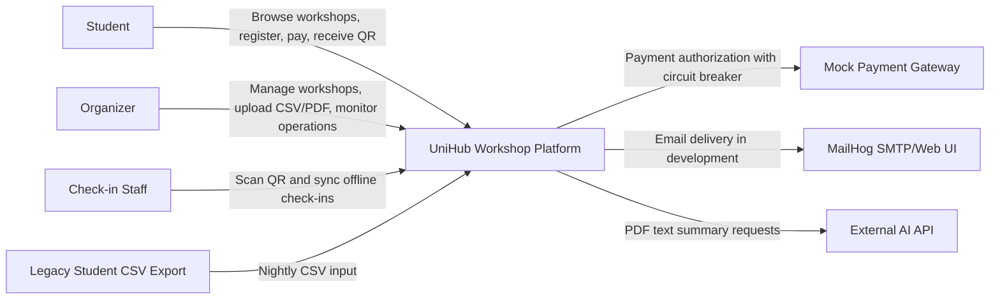
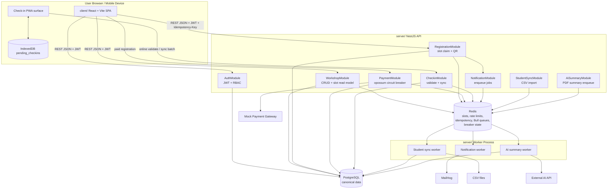
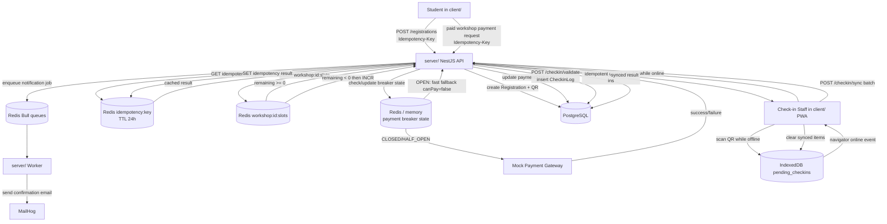

# UniHub Workshop - Technical Design

## Overall Architecture

UniHub Workshop sử dụng kiến trúc **Monolith module hóa** (Modular Monolith) kết hợp với một số thành phần bổ trợ độc lập.

**Lý do chọn Modular Monolith thay vì Microservices:**
Hệ thống có quy mô vừa, team nhỏ (2 người), thời gian hạn chế. Microservices mang lại overhead vận hành lớn không tương xứng với lợi ích ở giai đoạn này. Tuy nhiên các module được thiết kế độc lập (Payment, Notification, CheckIn, CSV Import) để có thể tách ra sau nếu cần.

**Các thành phần chính:**

- **Web App (React + Vite):** Giao diện sinh viên và trang admin.
- **Mobile PWA (React):** Giao diện check-in cho nhân sự, hỗ trợ offline.
- **Backend API (NestJS):** Xử lý toàn bộ nghiệp vụ, chia module rõ ràng.
- **PostgreSQL:** Database chính, lưu toàn bộ dữ liệu quan hệ.
- **Redis:** Cache slot workshop, lưu idempotency key, rate limiting counter, Circuit Breaker state.
- **Bull Queue (Redis-backed):** Xử lý bất đồng bộ — gửi email, AI summary, CSV import.
- **Mock Payment Gateway:** Mô phỏng cổng thanh toán để test Circuit Breaker và Idempotency Key.

**Giao tiếp giữa các thành phần:**
- Web/PWA ↔ Backend API: REST over HTTP, JWT trong Authorization header.
- Backend API ↔ PostgreSQL: Prisma ORM.
- Backend API ↔ Redis: ioredis (cache, coordination, rate limit, CB state).
- Backend API ↔ Bull Queue: Backend API đóng vai trò job producer; các worker process độc lập đóng vai trò consumer.
- Bull Queue → Email Service: SMTP (Nodemailer).
- Bull Queue → AI Model: HTTP call đến Anthropic API.
- Cronjob → CSV file: đọc file từ thư mục được mount, import vào PostgreSQL.

## C4 Diagram

### Level 1 - System Context



UniHub là nền tảng thống nhất cho việc xem workshop, đăng ký, thanh toán dự phòng, QR check-in và vận hành sự kiện. Người dùng truy cập qua `client/`; tích hợp và lưu trữ được điều phối bởi `server/`.

### Level 2 - Container




`server/` vẫn là HTTP modular monolith. Các tác vụ nền chạy trong worker process riêng và dùng Bull Queue trên Redis. PostgreSQL là nơi lưu dữ liệu canonical; Redis chỉ dùng cho phối hợp tạm thời và counter phía đọc.

## High-Level Architecture Diagram



Registration là luồng cần consistency cao nhất: API kiểm tra idempotency cache trước khi đụng tới trạng thái slot, dùng Redis `DECR` để claim slot atomic, ghi registration và QR đã xác nhận xuống PostgreSQL, rồi lưu response để retry an toàn. Nếu `DECR` trả về số âm, API bù lại bằng `INCR` và trả `409`.

Payment được tách khỏi luồng đăng ký miễn phí. Luồng có phí dùng cùng cơ chế idempotency, nhưng lời gọi đến mock gateway đi qua circuit breaker `opossum`; khi breaker open, API trả fallback thay vì tiếp tục gọi gateway.

Check-in hỗ trợ cả ghi nhận tức thì và ghi nhận trễ. Quét online gọi `POST /api/checkin/validate`; quét offline được lưu trong IndexedDB và đẩy lên `POST /api/checkin/sync` khi có mạng. Endpoint sync phải idempotent để batch gửi lặp không tạo trùng `CheckinLog`.


## Thiết kế cơ sở dữ liệu

### Lựa chọn database

Sử dụng **PostgreSQL** (SQL) làm database chính duy nhất.

**Lý do:**
- Dữ liệu có cấu trúc quan hệ rõ ràng: User — Registration — Workshop — Room.
- Cần ràng buộc dữ liệu và transaction cho các bản ghi nghiệp vụ như User, Workshop, Registration, CheckinLog.
- Luồng claim slot sử dụng Redis `DECR` atomic để xử lý tranh chấp số chỗ; PostgreSQL giữ vai trò lưu dữ liệu canonical và ràng buộc unique để chống đăng ký trùng.
- Team quen với SQL, không có usecase đặc thù cần NoSQL (không có document unstructured, không cần graph query).

Redis được dùng như **cache và coordination layer**, không phải database chính.

### Schema các entity chính

```sql
-- Người dùng hệ thống
User {
  id            UUID PRIMARY KEY
  studentId     VARCHAR UNIQUE      -- mã sinh viên, sync từ CSV
  email         VARCHAR UNIQUE
  name          VARCHAR
  role          ENUM(STUDENT, ORGANIZER, CHECKIN_STAFF)
  createdAt     TIMESTAMP
}

-- Workshop
Workshop {
  id            UUID PRIMARY KEY
  title         VARCHAR
  description   TEXT
  speaker       VARCHAR
  room          VARCHAR
  roomMapUrl    VARCHAR
  startTime     TIMESTAMP
  endTime       TIMESTAMP
  totalSlots    INT                 -- tổng số chỗ canonical; slot còn lại được phối hợp bằng Redis
  status        ENUM(DRAFT, OPEN, CANCELLED, COMPLETED)
  isPaid        BOOLEAN
  price         INT                 -- 0 = miễn phí
  aiSummary     TEXT                -- kết quả AI Summary
  createdAt     TIMESTAMP
}

-- Đăng ký tham dự
Registration {
  id             UUID PRIMARY KEY
  userId         UUID REFERENCES User(id)
  workshopId     UUID REFERENCES Workshop(id)
  status         ENUM(PENDING, CONFIRMED, CANCELLED)
  paymentStatus  ENUM(FREE, PENDING, PAID, FAILED, REFUNDED)
  qrCode         VARCHAR UNIQUE  -- mã QR để check-in
  idempotencyKey VARCHAR UNIQUE  -- chống request/thanh toán lặp
  createdAt      TIMESTAMP
  UNIQUE(userId, workshopId)
}

-- Lịch sử check-in (hỗ trợ offline sync)
CheckinLog {
  id             UUID PRIMARY KEY
  registrationId UUID UNIQUE REFERENCES Registration(id)
  checkedInAt    TIMESTAMP
  syncedAt       TIMESTAMP         -- null nếu chưa sync lên server
}
```


## Access Control Design

### Mô hình phân quyền: RBAC (Role-Based Access Control)

3 nhóm người dùng với quyền hạn cố định, không có điều kiện động → RBAC đơn giản là đủ, không cần ABAC.

| Quyền | STUDENT | ORGANIZER | CHECKIN_STAFF |
|---|---|---|---|
| Xem danh sách workshop | ✅ | ✅ | ✅ |
| Đăng ký workshop | ✅ | ❌ | ❌ |
| Xem "My Workshops" | ✅ | ❌ | ❌ |
| Tạo / sửa / hủy workshop | ❌ | ✅ | ❌ |
| Xem thống kê, danh sách đăng ký | ❌ | ✅ | ❌ |
| Quản lý users | ❌ | ✅ | ❌ |
| Quét QR check-in | ❌ | ❌ | ✅ |
| Xem danh sách đăng ký của workshop (để check-in) | ❌ | ❌ | ✅ |

### Cách triển khai

**JWT Payload:**
```json
{
  "sub": "user-uuid",
  "role": "STUDENT",
  "email": "user@example.com",
  "exp": 1234567890
}
```

- **Access token:** hết hạn sau 30 phút.
- **Refresh token:** hết hạn sau 7 ngày, lưu trong HttpOnly cookie.

**Guard trong NestJS:**
- `JwtAuthGuard`: verify token, gắn user vào request.
- `RolesGuard`: đọc `role` từ token, so sánh với decorator `@Roles()` trên endpoint.

**Áp dụng tại từng điểm truy cập:**
- `/api/workshops` (GET): public, không cần token.
- `/api/registrations` (POST): yêu cầu `STUDENT`.
- `/api/admin/workshops` (POST/PATCH/DELETE): yêu cầu `ORGANIZER`.
- `/api/checkin/validate` (POST): yêu cầu `CHECKIN_STAFF`.
- Trang admin React: redirect về `/login` nếu role không phải `ORGANIZER`.
- PWA check-in: ẩn toàn bộ UI nếu role không phải `CHECKIN_STAFF`.

## System Protection Design

### Traffic Spike Control


**Giải pháp: Token Bucket** implemented bằng Redis + NestJS Throttler.

**Lý do chọn Token Bucket thay vì Fixed Window:**
Token Bucket cho phép burst ngắn hạn (sinh viên click nhanh 2–3 lần vẫn qua) nhưng giới hạn tốc độ trung bình. Fixed Window bị lỗi boundary — sinh viên có thể gửi 2x request ngay tại ranh giới cửa sổ thời gian.

**Cấu hình:**
- Mỗi IP: tối đa **20 request/10 giây** cho endpoint chung.
- Endpoint `/api/registrations` (POST): tối đa **5 request/30 giây** per user (theo JWT `sub`).

**Hành vi khi vượt ngưỡng:**
- Trả về HTTP `429 Too Many Requests`.
- Header `Retry-After` cho client biết bao giờ thử lại.
- Frontend hiển thị thông báo "Bạn đang thao tác quá nhanh, vui lòng thử lại sau X giây."

**Chống tranh chấp slot (race condition):**
Dùng Redis `DECR` trên key slot của workshop để claim chỗ atomic. Nếu kết quả âm, API gọi `INCR` để hoàn slot và trả `409`. PostgreSQL lưu bản ghi canonical và ràng buộc unique, không dùng DB row locking làm cơ chế claim slot chính.

### Payment Gateway Instability


**Giải pháp: Circuit Breaker** với 3 trạng thái, state lưu trong Redis.

**Các trạng thái:**

| Trạng thái | Mô tả | Chuyển sang |
|---|---|---|
| **Closed** (bình thường) | Mọi request được gửi đến payment gateway | → Open khi ≥ 5 lỗi liên tiếp trong 60 giây |
| **Open** (đã ngắt) | Không gọi payment gateway, trả lỗi ngay | → Half-Open sau 30 giây |
| **Half-Open** (thử lại) | Cho 1 request thử qua | → Closed nếu thành công, → Open nếu thất bại |

**Graceful Degradation khi CB Open:**
- API vẫn phục vụ bình thường cho các endpoint không liên quan đến thanh toán.
- Endpoint đăng ký workshop miễn phí: **không bị ảnh hưởng**.
- Endpoint đăng ký workshop có phí: trả về HTTP `503` với message rõ ràng.
- Frontend: ẩn nút "Đăng ký" trên workshop có phí, hiển thị banner "Hệ thống thanh toán đang gián đoạn, vui lòng thử lại sau."
- Trang danh sách workshop, trang chi tiết: **load bình thường**.

### Double Charge / Duplicate Registration Prevention


**Giải pháp: Idempotency Key**

**Luồng hoạt động:**

1. Frontend sinh `idempotencyKey = UUID v4` khi user bấm "Đăng ký".
2. Key được gửi kèm trong header `Idempotency-Key` của request.
3. Backend kiểm tra Redis: `EXISTS idempotency:{key}`.
   - Nếu **không tồn tại**: xử lý bình thường, lưu key vào Redis với TTL 24 giờ, lưu key vào cột `idempotencyKey` trong bảng `Registration`.
   - Nếu **đã tồn tại**: trả về kết quả của lần xử lý trước (lấy từ DB theo key), không xử lý lại.
4. Nếu payment gateway timeout: trả lỗi cho client, **không xóa key**. Client retry với cùng key → backend phát hiện đã có → kiểm tra trạng thái trong DB → trả về kết quả đúng.

**Nơi lưu trữ:** Redis (kiểm tra nhanh) + PostgreSQL cột `idempotencyKey` (source of truth khi Redis bị xóa).

**TTL:** 24 giờ — đủ dài để cover mọi retry trong một phiên đăng ký.

## Architecture Decision Records

### ADR-1: JWT thuần thay vì Session

**Chọn:** JWT stateless (access token 30 phút + refresh token 7 ngày trong HttpOnly cookie).

**Lý do:** Backend NestJS có thể scale ngang mà không cần sticky session. Mỗi request tự verify token mà không cần round-trip đến Redis. RBAC 3 nhóm quyền cố định — không có usecase cần thu hồi token ngay lập tức.

**Đánh đổi:** Nếu token bị lộ, phải chờ hết 30 phút mới vô hiệu. Chấp nhận được ở scope đồ án vì không có dữ liệu tài chính thật.

---

### ADR-2: PostgreSQL thay vì MongoDB

**Chọn:** PostgreSQL duy nhất cho toàn bộ dữ liệu nghiệp vụ.

**Lý do:** Dữ liệu có quan hệ rõ ràng, cần JOIN, ràng buộc unique và transaction ACID cho bản ghi canonical. Bài toán tranh chấp slot được xử lý bằng Redis `DECR`; PostgreSQL đảm bảo dữ liệu đăng ký không trùng và có thể audit. Team quen SQL.

**Đánh đổi:** Khó scale write theo chiều ngang hơn MongoDB. Không ảnh hưởng ở quy mô đồ án.

---

### ADR-3: Bull Queue thay vì Kafka

**Chọn:** Bull Queue (Redis-backed) cho tác vụ bất đồng bộ — gửi email, AI summary, CSV import.

**Lý do:** Team 2 người, không có thời gian vận hành Kafka cluster. Bull Queue đơn giản, tích hợp tốt với NestJS, đủ dùng cho lượng job của hệ thống này. Redis đã có sẵn cho cache và rate limiting — tái sử dụng không cần thêm infrastructure.

**Đánh đổi:** Không có message replay, partition, consumer group như Kafka. Không cần thiết ở quy mô này.

---

### ADR-4: Pipe-and-Filter cho AI Summary pipeline

**Chọn:** Pipe-and-Filter — mỗi bước xử lý độc lập: Upload PDF → Extract text → Clean text → Call AI API → Save summary.

**Lý do:** Dễ thêm/bớt bước xử lý (ví dụ: thêm bước dịch thuật) mà không ảnh hưởng các bước khác. Mỗi bước có thể retry độc lập khi lỗi. Phù hợp với Bull Queue — mỗi filter là một job.

**Đánh đổi:** Dữ liệu phải serialize/deserialize giữa các bước, tốn thêm một chút overhead. Không đáng kể với kích thước PDF vừa phải.

---

### ADR-5: IndexedDB cho offline check-in PWA

**Chọn:** IndexedDB trong PWA (Progressive Web App) để lưu check-in tạm khi mất mạng.

**Lý do:** PWA không cần cài đặt, nhân sự dùng ngay trên trình duyệt mobile. IndexedDB là storage API native của browser, không cần thư viện ngoài, đủ dùng cho volume check-in của một phòng workshop (~60 bản ghi).

**Đánh đổi:** Không có SQLite với đầy đủ query capability. Dữ liệu mất nếu user xóa storage trình duyệt. Chấp nhận được vì sync lên server ngay khi có mạng.
