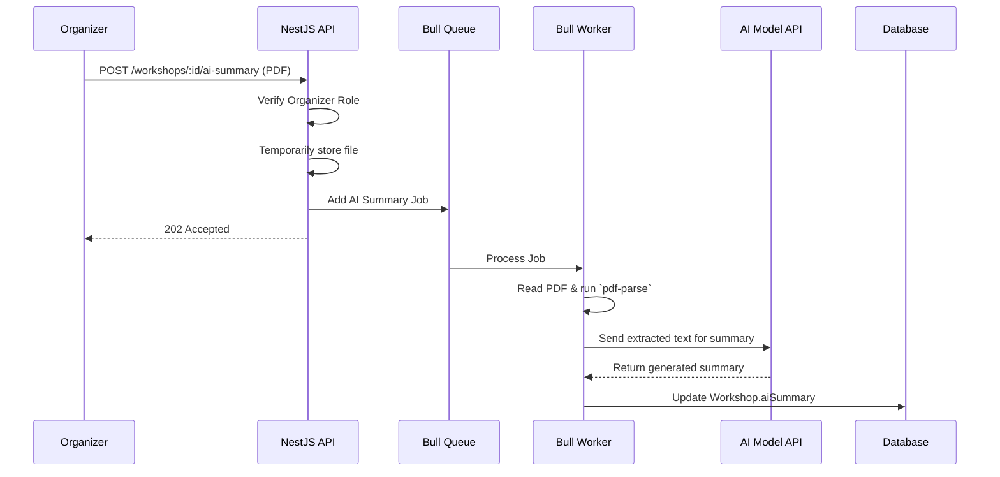

# Design: AI Summary Implementation

## Overview
This feature relies on a worker-queue pattern. When a PDF is uploaded, a job is added to a Redis-backed Bull queue. A worker then processes this job by reading the file, parsing it with `pdf-parse`, calling the AI API, and finally updating the database.

## Flow

## Module Mapping
- **`server/src/workshops/`**:
  - Add file upload endpoint `POST /:id/ai-summary`.
  - Add `@nestjs/bull` queue integration.
- **`server/src/ai-summary/`** (or worker module):
  - Bull queue processor `AiSummaryProcessor`.
  - Logic to use `pdf-parse` and call AI model.
- **`client/src/pages/WorkshopDetails/`**:
  - UI for Organizers to upload the PDF.
  - UI for Students to read the `aiSummary` if it exists.
  - Loading state indicator for pending summaries.
