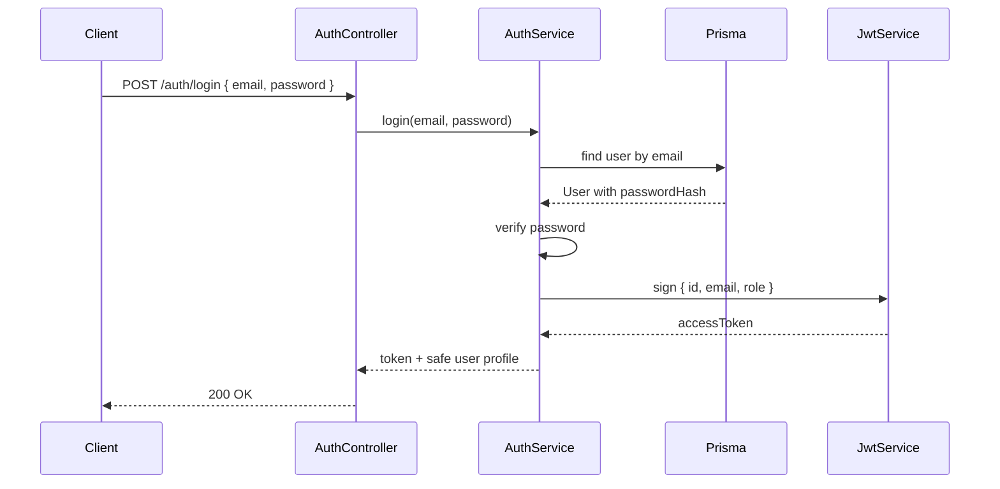
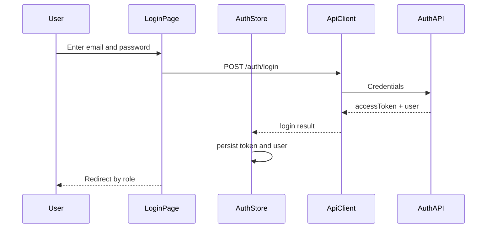
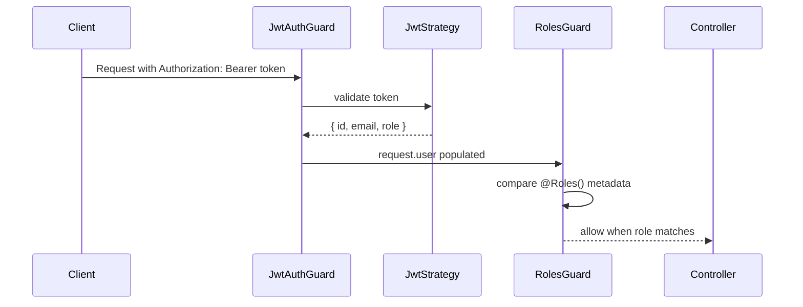

# Design: Implement Auth

## Overview

Replace the development auth stub with a small NestJS auth stack:

- `AuthController` accepts login requests.
- `AuthService` validates email/password credentials and signs JWTs.
- `JwtStrategy` verifies bearer tokens and returns the request user payload.
- `JwtAuthGuard` protects secured routes.
- `RolesGuard` continues enforcing `@Roles()` after JWT authentication has populated `request.user`.
- React auth UI submits credentials, stores the returned token/user, attaches JWTs through the shared API client, and gates routes by role.

This implements TASK.MD patterns F1 JWT and F4 RBAC while preserving the existing `auth` capability contract.

## Flow

## Module Mapping

- `server/src/modules/auth/auth.module.ts`
  - imports `JwtModule`, `PassportModule`, and `PrismaModule`.
  - provides `AuthService` and `JwtStrategy`.
- `server/src/modules/auth/auth.controller.ts`
  - exposes `POST /auth/login`.
- `server/src/modules/auth/dto/login.dto.ts`
  - validates `email` and `password` with `class-validator`.
- `server/src/common/guards/jwt-auth.guard.ts`
  - wraps Passport's `jwt` strategy.
- `server/src/common/decorators/current-user.decorator.ts`
  - returns `request.user`.
- `server/prisma/schema.prisma`
  - adds `passwordHash String?` to `User`.
- `client/src/lib/api.ts`
  - attaches the persisted JWT to protected requests and clears auth state on HTTP 401.
- `client/src/features/auth` or equivalent local auth folder
  - owns auth types, auth store/hook, login page, and protected route behavior.
- `client/src/components`
  - should be checked before creating form, button, field, or feedback components. If no suitable component exists, add a small shared component using the theme tokens.
- `client/src/index.css` and `client/tailwind.config.ts`
  - remain the source of truth for frontend colors, spacing feel, and shared visual tokens.

## Credential Strategy

Use a one-way password hash stored on `User.passwordHash`. To keep the change dependency-light, use Node's built-in `crypto.scrypt` or `crypto.pbkdf2` with per-password salt encoded in the stored hash string. The auth service only compares hashes; it never returns `passwordHash` in responses or JWT payloads.

Seed data should assign a documented local demo password for students, organizers, and check-in staff, such as `Password123!`, so manual verification is repeatable.

## JWT Configuration

- `JWT_SECRET` comes from environment variables.
- `JWT_EXPIRES_IN` is optional, defaulting to a short local value such as `1h`.
- The JWT payload is limited to:
  - `id`
  - `email`
  - `role`

## ADR

### ADR-001: JWT access tokens only

Status: Accepted

UniHub will implement access-token-only auth for this version because the existing auth spec explicitly excludes refresh tokens. This keeps the demo and role protection simple while leaving room for token rotation in a later change.

### ADR-002: Password hash on User

Status: Accepted

`User` already represents students, organizers, and check-in staff, so storing a nullable `passwordHash` on the same model avoids creating an account table before the domain needs it. The field is nullable to allow imported or staged users before credentials are assigned.

## Error Handling

- Unknown email and wrong password both return HTTP 401.
- Missing, expired, malformed, or incorrectly signed bearer tokens return HTTP 401.
- Authenticated callers with the wrong role return HTTP 403 via `RolesGuard`.
- Login validation errors return HTTP 400 through the global `ValidationPipe`.
- Frontend login displays validation/auth errors without exposing whether an email exists.
- Frontend HTTP 401 clears the local token/user and returns the user to login for protected views.
- Frontend role mismatch redirects or blocks access without rendering protected content.

## Frontend Style Consistency

Auth UI must follow the baseline auth spec constraint:

- First look for reusable components in `client/src/components`.
- Use theme tokens from `client/src/index.css` and `client/tailwind.config.ts`.
- Create shared components only when no suitable component exists.
- Keep the current white starting page clean until real auth UI is added.

## Manual Verification

- Fresh seed creates demo users with usable credentials.
- Valid login returns a signed access token and user profile.
- Invalid password returns HTTP 401.
- Protected route without token returns HTTP 401.
- Protected route with wrong role returns HTTP 403.
- Protected route with required role returns HTTP 200.
- Frontend login stores the token and user after valid credentials.
- Frontend protected routes block unauthenticated users.
- Frontend role-scoped routes block users with the wrong role.
- Frontend logout clears persisted auth state.
