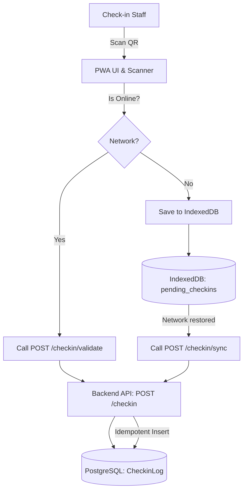

# Technical Design: Offline and Online Check-in

## Overview
The check-in feature uses the `CheckinModule` on the backend (NestJS) and an offline-first PWA approach on the frontend (React). `CheckinLog` records are mapped to existing `Registration` records.

## Flow


## Module Mapping
- **`server/src/checkin`**: 
  - `CheckinController`: Expose `/checkin/validate` and `/checkin/sync`. Requires `CHECKIN_STAFF` role.
  - `CheckinService`: Business logic for finding a registration by `qrCode` or `id`, validating its status (`CONFIRMED`), and creating `CheckinLog`. Batch sync handles arrays of payloads and gracefully ignores duplicate `registrationId`s.
- **`client/src/pages/checkin`**:
  - `CheckinPage`: The main PWA page for staff.
  - `Scanner`: React component to interface with device camera (e.g., using `html5-qrcode` or modern BarcodeDetector API if applicable).
  - `OfflineQueue`: UI to show pending check-ins.
- **`client/src/lib/idb`**: 
  - Utility to wrap `IndexedDB` interactions for `pending_checkins` object store.

## Data Structure
We use the existing Prisma schema:
```prisma
model CheckinLog {
  id             String       @id @default(cuid())
  registrationId String       @unique
  staffId        String
  deviceId       String?
  checkedInAt    DateTime
  syncedAt       DateTime?
  // relations...
}
```
Validation ensures the `registration.status == CONFIRMED` and `registration.paymentStatus != FAILED`. If offline check-in pushes an invalid registration during sync, the backend ignores or marks it as an error, ensuring canonical DB validity.
