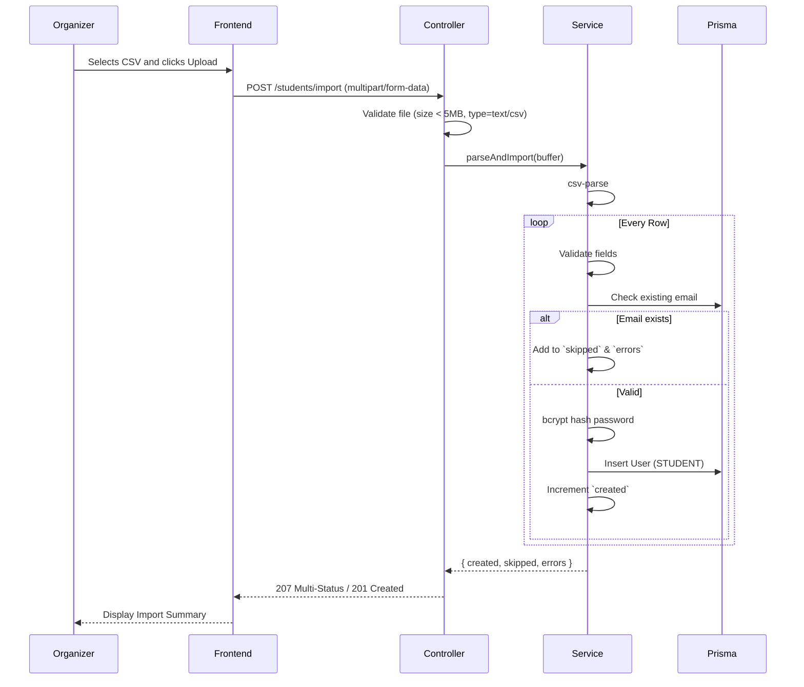

# Design: Implement CSV Import

## Overview

Replace manual account creation by implementing a bulk CSV import feature. The backend will synchronously process a `.csv` file up to 5MB and 1000 rows, returning a summary of successes and failures. The frontend will provide a file upload interface restricted to organizers.

## Flow

## Module Mapping

- `server/package.json`
  - Add `csv-parse` and `@types/multer`.
- `server/src/modules/users/users.controller.ts` (or `students.controller.ts`)
  - Exposes `POST /students/import` guarded by `JwtAuthGuard` and `RolesGuard('ORGANIZER')`.
  - Uses `FileInterceptor`.
- `server/src/modules/users/users.service.ts`
  - Processes the CSV using `csv-parse`.
- `client/src/services/api.ts`
  - Exposes a typed API function to upload `FormData`.
- `client/src/pages/admin/StudentsPage.tsx`
  - Displays the file input, upload progress, and the result summary block.

## File Processing Strategy

- The upload uses `multipart/form-data`.
- NestJS `FileInterceptor` validates the size and MIME type.
- Synchronous processing is used because the 1000 row limit ensures the event loop won't be blocked for a problematic amount of time.

## Error Handling

- **Invalid File Type/Size**: Returns HTTP 400 Bad Request.
- **Partial Success**: Returns HTTP 207 Multi-Status with a detailed JSON body:
  `{ created: 10, skipped: 2, errors: ["Row 3: email already exists", "Row 5: missing name"] }`
- **Total Success**: Returns HTTP 201 Created.

## Frontend UI

- A file input constrained to `accept=".csv"`.
- A submit button that manages loading state.
- A results component that displays green text for successful creations and red text for specific skipped rows and reasons.
