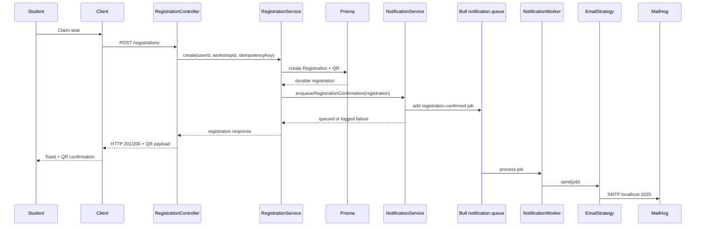
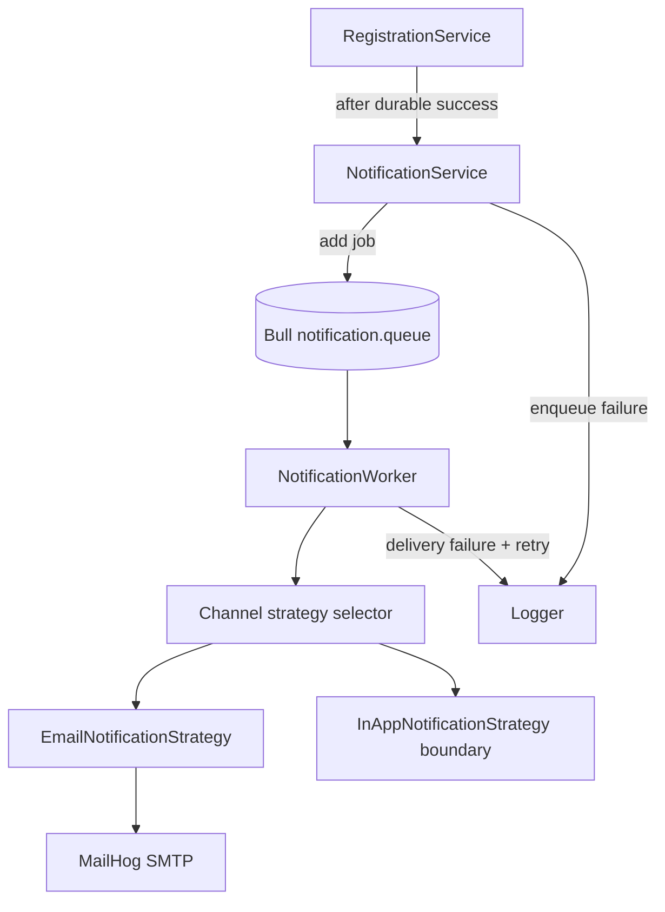

# Design: Implement Notification

## Overview

Implement the notification slice as an asynchronous backend feature connected to registration success:

- `NotificationModule` owns queue registration, enqueueing, channel strategy selection, and worker processing.
- `RegistrationService` calls `NotificationService.enqueueRegistrationConfirmation()` after a registration is durably created and the response payload is available.
- `NotificationWorker` consumes Bull `notification.queue` jobs and dispatches to configured channel strategies.
- `EmailNotificationStrategy` sends development email through MailHog using Nodemailer.
- The student UI keeps using immediate toast and QR confirmation as the app-facing notification surface; no realtime or inbox feature is introduced in this bounded slice.

## Flow





## Module Mapping

- `server/src/modules/notification/notification.module.ts`
  - Import `BullModule.registerQueue({ name: NOTIFICATION_QUEUE })`.
  - Provide `NotificationService`, `NotificationWorker`, and channel strategies.
  - Export `NotificationService` for `RegistrationModule`.
- `server/src/modules/notification/notification.service.ts`
  - Define `NOTIFICATION_QUEUE`.
  - Expose `enqueueRegistrationConfirmation(input)`.
  - Convert registration data into a stable queue payload.
  - Catch/log enqueue errors so registration remains successful.
- `server/src/modules/notification/notification.worker.ts`
  - Use `@Processor(NOTIFICATION_QUEUE)` and `WorkerHost`.
  - Process `registration-confirmed` jobs.
  - Let Bull retry delivery failures while logging enough context.
- `server/src/modules/notification/channels/notification-channel.strategy.ts`
  - Define the strategy interface and supported notification payload types.
- `server/src/modules/notification/channels/email-notification.strategy.ts`
  - Use Nodemailer transport pointed at `MAIL_HOST`/`MAIL_PORT`, defaulting to `localhost:1025`.
  - Render a concise registration confirmation email containing workshop title, schedule, room, payment status, and QR payload or app guidance.
- `server/src/modules/notification/channels/in-app-notification.strategy.ts`
  - Provide a no-op or metadata-only strategy boundary for app-facing notifications in this slice.
  - Keep the extension point explicit for future inbox/realtime channels.
- `server/src/modules/registration/registration.module.ts`
  - Import `NotificationModule`.
- `server/src/modules/registration/registration.service.ts`
  - Inject `NotificationService`.
  - Enqueue after successful create/idempotent response when appropriate.
  - Do not enqueue duplicate notifications for cached idempotency responses unless the implementation explicitly detects the original job was never queued.
- `client/src/pages/student/StudentWorkspace.tsx`
  - Keep existing registration success toast and QR confirmation.
  - Adjust copy only if needed to say confirmation is shown in app and email is being sent.
- `client/src/pages/student/WorkshopDetailPage.tsx`
  - Preserve existing registration flow and QR display; align copy only if needed.

## Queue Payload

Use a stable, serializable payload that avoids passing Prisma objects directly:

```ts
type RegistrationNotificationJob = {
  type: 'registration-confirmed';
  registrationId: string;
  userId: string;
  studentEmail: string;
  studentName: string;
  workshop: {
    id: string;
    title: string;
    room: string;
    startTime: string;
    endTime: string;
    isPaid: boolean;
  };
  paymentStatus: 'FREE' | 'PENDING' | 'PAID' | 'FAILED' | 'REFUNDED';
  qrCode: string | null;
};
```

## Delivery And Retry

- Bull job name: `registration-confirmed`.
- Queue name: `notification.queue`.
- Suggested attempts: 3.
- Suggested backoff: exponential, starting at 5 seconds.
- Worker concurrency: low default, for example 5, because MailHog/local SMTP does not need high throughput.
- Worker failure behavior: throw from the worker after logging so Bull records the failure and retries.
- Registration request behavior: catch enqueue errors, log them, and still return the successful registration response.

## Configuration

- `REDIS_URL`: existing Redis connection string, default `redis://localhost:6379`.
- `MAIL_HOST`: default `localhost`.
- `MAIL_PORT`: default `1025`.
- `MAIL_FROM`: default `UniHub Workshop <no-reply@unihub.local>`.
- `NOTIFICATION_EMAIL_ENABLED`: default enabled in development; may be disabled for tests.

Development email must route to MailHog. The implementation should avoid provider credentials or public SMTP defaults.

## Frontend Behavior

The frontend already receives immediate registration data and QR image from `POST /registrations`. This is the app-facing notification for the bounded slice:

- On successful free registration, show the existing success toast and latest confirmation QR section.
- On successful paid registration, show the existing success toast plus pending payment action.
- Do not wait for email delivery before showing success.
- Do not add a polling inbox, websocket, or notification center in this change.

## Error Handling

- Missing recipient email in a notification payload should fail the job with a clear worker error; registration remains successful.
- SMTP connection failures should be retried by Bull and visible in worker logs.
- Unknown job names should be logged and ignored or failed explicitly, depending on existing worker conventions.
- Strategy failures should not be swallowed inside the strategy; the worker should own retry semantics.

## Assumptions

- MailHog is available locally through the Docker setup at SMTP port 1025.
- `User.email` and `User.name` are available when creating or reading the registration notification payload.
- A durable in-app notification table does not yet exist; introducing one is outside this proposal unless discovered during implementation.
- Existing student toast/QR surfaces are sufficient for the required app-facing confirmation.

## Verification

- Backend build passes.
- Frontend build passes if any copy changes are made.
- Registering for a free workshop returns immediately and enqueues a `registration-confirmed` job.
- Registering for a paid workshop returns immediately, keeps payment pending, and enqueues a `registration-confirmed` job.
- MailHog receives a confirmation email with correct student, workshop, schedule, room, payment status, and QR details.
- Stopping MailHog causes worker retries/failures without rolling back or failing the original registration.
- Adding a test strategy can be done inside `NotificationModule` without changing `RegistrationService`.
