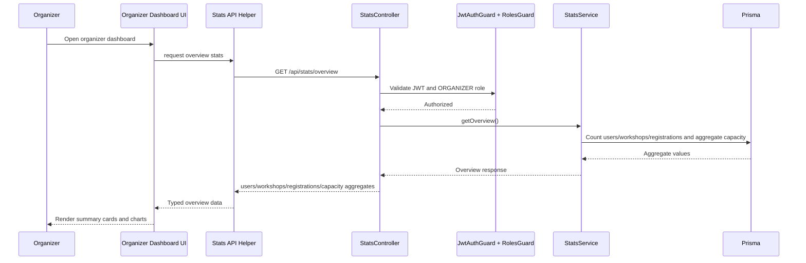
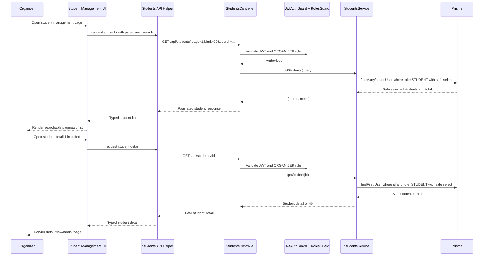

# Design: Organizer Dashboard + Student Management

## 1. Overview

This change combines organizer dashboard stats and organizer student management into one bounded feature because the UI directly depends on the backend API contracts.

The backend adds read-only organizer APIs for overview aggregates and safe student browsing. The frontend reuses the existing organizer workspace to render dashboard cards/charts and a student management page with search and pagination.

This change must not implement full user administration. It must not add user create/update/delete APIs, role management APIs, revenue analytics, payment analytics, check-in analytics, time-series analytics, migrations, or new dependencies.

## 2. Flow

### Dashboard Stats Flow



### Student Management Flow



## 3. Module Mapping

Backend mapping:

- Extend `server/src/modules/students`.
  - Add `GET /students` and `GET /students/:id` handlers.
  - Keep existing CSV import and student-sync behavior unchanged.
  - Add DTO validation for list query params.
  - Use explicit safe Prisma selects.
- Add `server/src/modules/stats`.
  - Add `StatsModule`.
  - Add `StatsController` for `GET /stats/overview`.
  - Add `StatsService` for aggregate counts.
- Register `StatsModule` in `AppModule`.

Frontend mapping:

- Reuse existing organizer workspace layout/routes.
- Add or update organizer dashboard page for stats charts/cards.
- Add or update student management page for student list/search/pagination.
- Add client API helpers for stats/students if not already present.
- Add or update TypeScript types if needed.

## 4. API Design

### `GET /api/students`

Access:

- `JwtAuthGuard`
- `RolesGuard`
- `@Roles(Role.ORGANIZER)`

Query:

- `page`: optional integer, default `1`, minimum `1`
- `limit`: optional integer, default `20`, minimum `1`, maximum `100`
- `search`: optional string matched against student `name`, `email`, or `studentId`

Response:

```json
{
  "items": [
    {
      "id": "...",
      "email": "...",
      "name": "...",
      "studentId": "...",
      "role": "STUDENT",
      "createdAt": "..."
    }
  ],
  "meta": {
    "page": 1,
    "limit": 20,
    "total": 100,
    "totalPages": 5
  }
}
```

The endpoint returns only users where `role = STUDENT`.

### `GET /api/students/:id`

Access:

- `JwtAuthGuard`
- `RolesGuard`
- `@Roles(Role.ORGANIZER)`

Response:

```json
{
  "id": "...",
  "email": "...",
  "name": "...",
  "studentId": "...",
  "role": "STUDENT",
  "createdAt": "..."
}
```

Unknown ids and non-`STUDENT` ids return HTTP 404.

### `GET /api/stats/overview`

Access:

- `JwtAuthGuard`
- `RolesGuard`
- `@Roles(Role.ORGANIZER)`

Response:

```json
{
  "users": {
    "total": 100,
    "students": 90,
    "organizers": 8,
    "checkinStaff": 2
  },
  "workshops": {
    "total": 20,
    "draft": 3,
    "open": 10,
    "cancelled": 2,
    "completed": 5
  },
  "registrations": {
    "total": 300,
    "pending": 40,
    "confirmed": 250,
    "cancelled": 10
  },
  "capacity": {
    "totalSlots": 500,
    "remainingSlots": 200,
    "claimedSlots": 300
  }
}
```

Capacity is derived from current workshop fields:

- `totalSlots = sum(Workshop.totalSlots)`
- `remainingSlots = sum(Workshop.slotLeft)`
- `claimedSlots = totalSlots - remainingSlots`

The endpoint is read-only and does not include payment, revenue, check-in, or time-series analytics.

## 5. UI Design

Dashboard UI:

- Summary cards:
  - total users/students
  - total workshops
  - total registrations
  - capacity usage
- Charts based on `/api/stats/overview`:
  - users by role
  - workshops by status
  - registrations by status
  - capacity usage
- Must handle loading, empty, and error states.
- Must be responsive and consistent with the existing UI style.

Student management UI:

- Search input.
- Paginated student table/list.
- Safe student fields only:
  - `id`
  - `email`
  - `name`
  - `studentId`
  - `role`
  - `createdAt`
- Detail view/modal/page if included.
- Must not show `passwordHash`, token hashes, refresh tokens, or auth secrets.
- Must be responsive and consistent with the existing UI style.

## 6. Auth/RBAC

- All backend endpoints are `ORGANIZER` only.
- Frontend routes are protected for `ORGANIZER` only.
- Missing, expired, or malformed JWTs return HTTP 401.
- Authenticated non-organizer users return HTTP 403.

## 7. Data Safety

- Use explicit Prisma `select` for student list and detail.
- Do not return sensitive fields or broad relation payloads.
- Allowed student fields are `id`, `email`, `name`, `studentId`, `role`, and `createdAt`.
- Do not return `updatedAt` if the current Prisma `User` schema does not have it.
- Do not expose `passwordHash`, refresh tokens, token hashes, auth secrets, payment internals, QR codes, or idempotency keys.

## 8. Prisma Query Strategy

Students list pagination/search:

- Use `findMany` and `count` with the same `where` filter.
- Always filter `role: Role.STUDENT`.
- Apply optional search across `name`, `email`, and `studentId`.
- Use `skip = (page - 1) * limit`.
- Use `take = limit`.
- Use deterministic ordering such as `createdAt desc`.

Student detail safe select:

- Use `findFirst` with both `id` and `role: Role.STUDENT`.
- Return 404 for missing records.
- Use the same safe field projection as the list response.

Stats aggregate counts:

- Count all users and users by `Role`.
- Count all workshops and workshops by `WorkshopStatus`.
- Count all registrations and registrations by `RegistrationStatus`.
- Aggregate `Workshop.totalSlots` and `Workshop.slotLeft`.
- Do not query or infer payment, revenue, check-in, or time-series analytics.

## 9. Error Handling

- 401 unauthenticated.
- 403 wrong role.
- 404 unknown/non-student id.
- 400 invalid query.
- Frontend loading, error, and empty states for dashboard and student management pages.

## 10. Risks

- Exposing sensitive user fields through broad Prisma selects or relation payloads.
- Scope creep into full admin user management.
- Dashboard charts implying analytics not supported by the current schema.
- Inconsistent capacity if Redis and DB slot values differ.

## 11. Verification

Backend:

- Build passes.
- Endpoints are protected for `ORGANIZER` only.
- Sensitive fields are excluded.
- Counts match DB records.

Frontend:

- Organizer dashboard renders cards/charts.
- Student management search/pagination works.
- Loading/error/empty states work.
- Mobile responsive check passes.
