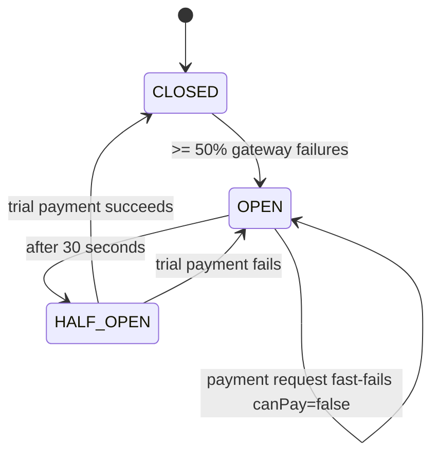

# Design: Implement Payment

## Overview

Payment stays a separate step after registration. The existing registration flow remains responsible for slot claiming and registration creation:

- Free workshop: `POST /registrations` claims a slot with Redis `DECR`, creates `Registration`, sets `paymentStatus = FREE`, and remains complete even if payment is unavailable.
- Paid workshop: `POST /registrations` claims a slot with the same Redis `DECR` behavior, creates `Registration`, sets `paymentStatus = PENDING`, and returns control to the student UI with a clear next action to complete payment.

The next frontend UX slice adds a dedicated student payment route instead of continuing to place payment controls inline near QR confirmation UI:

- Route: `/student/payments/:registrationId`
- Router integration: add the route through the existing React Router structure in `client/src/App.tsx`, using the existing `ProtectedRoute allowedRoles={['STUDENT']}` and `WorkspaceLayout role="STUDENT"` pattern.
- Page ownership: add a route-level student payment page under the existing student page/feature conventions, with payment-specific UI and API calls kept out of broad dashboard/card components.
- Eligibility: the page is for paid student registrations whose registration status is `PENDING` and payment status is `PENDING`; free, paid, cancelled, unknown, or unauthorized registrations show an unavailable state instead of a checkout UI.

This UX change does not replace the current registration flow. Students still browse workshops, register, and receive QR confirmation through the existing student pages. Paid pending registrations link to the dedicated payment page via a clean "Complete payment" action.

`PaymentModule` owns gateway interaction, Circuit Breaker state, and payment idempotency. Workshop list/detail endpoints must not depend on `PaymentModule`, so browsing continues even when the payment circuit is open. Payment failure must not compensate, restore, or mutate workshop slot counters.

## Flow

```mermaid
sequenceDiagram
    participant Student
    participant Registration as Registration API
    participant Redis as Redis Slots
    participant DB as PostgreSQL
    participant UI as Student UI
    participant PaymentPage as /student/payments/:registrationId
    participant Payment as Payment API
    participant Idempotency as Payment Idempotency
    participant Breaker as Circuit Breaker
    participant Gateway as Mock Gateway

    Student->>Registration: POST /registrations (paid workshop, Idempotency-Key)
    Registration->>Redis: DECR workshop:id:slots
    Redis-->>Registration: remaining >= 0
    Registration->>DB: Create Registration paymentStatus=PENDING
    Registration-->>Student: Pending registration + QR payload
    UI-->>Student: Toast: seat held; show Complete payment action

    Student->>PaymentPage: Navigate to /student/payments/:registrationId
    PaymentPage->>Payment: GET /payment/status
    PaymentPage->>Registration: Load student registration data
    Registration->>DB: Read registrations for authenticated student
    DB-->>Registration: Student registrations
    Registration-->>PaymentPage: Registration details for matching id
    alt canPay=false or status lookup fails
        PaymentPage-->>Student: Inline payment unavailable alert; Pay now disabled
    else paid PENDING registration
        PaymentPage-->>Student: Payment summary + mock method selection + Pay now CTA
        Student->>Payment: POST /payment/registrations/:id/pay (Idempotency-Key)
        Payment->>DB: Verify registration belongs to student and is paid + PENDING/PAID
        Payment->>Idempotency: Load existing payment result
        alt duplicate completed key
            Idempotency-->>Payment: Prior result
            Payment-->>Student: Prior result, no gateway call
        else new payment key
            Payment->>Breaker: Execute gateway payment
            alt circuit open
                Breaker-->>Payment: fallback canPay=false
                Payment-->>Student: { canPay: false }
                PaymentPage-->>Student: Inline unavailable state; toast if triggered by Pay now
            else gateway succeeds
                Breaker->>Gateway: authorize payment
                Gateway-->>Breaker: success
                Payment->>DB: Update Registration.paymentStatus=PAID
                Payment->>Idempotency: Persist success result
                Payment-->>Student: payment confirmation
                PaymentPage-->>Student: Success state + toast
            else gateway fails below threshold
                Gateway-->>Breaker: failure
                Payment->>DB: Keep or set paymentStatus=FAILED/PENDING retryable
                Payment-->>Student: HTTP 502
                PaymentPage-->>Student: Retryable failure state + toast
            end
        end
    end
```

## Circuit Breaker Flow



## Module Mapping

- `server/src/modules/payment/payment.module.ts`
  - Provides controller, service, gateway, and breaker wiring.
- `server/src/modules/payment/payment.controller.ts`
  - Exposes `GET /payment/status` and protected `POST /payment/registrations/:registrationId/pay`.
- `server/src/modules/payment/payment.service.ts`
  - Validates registration ownership and status, enforces idempotency, executes the Circuit Breaker, and updates payment status.
- `server/src/modules/payment/mock-payment-gateway.ts`
  - Simulates gateway success/failure with a 30 percent failure rate in development.
- `server/src/modules/payment/payment-breaker.service.ts`
  - Owns `opossum` configuration and exposes status/fallback behavior.
- `server/src/modules/payment/dto/pay-registration.dto.ts`
  - Optional body validation for payment metadata if needed; `Idempotency-Key` remains required in the header.
- `server/prisma/schema.prisma`
  - Add minimal durable payment attempt storage only for duplicate-charge prevention and stored payment result replay.
- `client/src/App.tsx`
  - Add `/student/payments/:registrationId` inside the existing student protected route pattern.
- `client/src/pages/student/PaymentPage.tsx` or an equivalent student feature-owned route file
  - Own the dedicated payment screen, registration eligibility checks, payment status loading, mock method selection, CTA state, and success/failure/unavailable UI.
- `client/src/lib/paymentApi.ts`
  - Typed calls for payment status and paying a pending registration with a generated payment idempotency key.
- `client/src/lib/registrationApi.ts`
  - Reuse existing student registration listing/detail access for payment page data unless a tiny API gap is identified.
- `client/src/types/registration.ts`
  - Extend payment response/status types as needed without duplicating role or workshop status literals.
- `client/src/pages/student/StudentWorkspace.tsx`
  - Remove inline Pay now execution and stacked payment messages; show only a clean "Complete payment" navigation action for paid pending registrations.
- `client/src/pages/student/WorkshopDetailPage.tsx`
  - After paid registration creation, show a clear next action that navigates to the dedicated payment page; do not keep inline payment execution in the detail card.

## Backend Behavior

### Registration Contract

The payment implementation must not change how registration claims seats:

- Keep Redis `DECR` and compensating `INCR` behavior in `RegistrationService`.
- Keep one registration per student/workshop.
- Keep free registration returning immediately with `paymentStatus = FREE`.
- Keep paid registration returning a retryable `paymentStatus = PENDING`.
- Payment failure, gateway unavailability, or circuit-open fallback must not call slot compensation logic, increment Redis slot counters, or mutate `Workshop.slotLeft`.

### Payment Endpoint

`POST /api/payment/registrations/:registrationId/pay`

- Requires `JwtAuthGuard`, `RolesGuard`, and `@Roles(Role.STUDENT)`.
- Requires `Idempotency-Key` header.
- Verifies the registration belongs to the authenticated student.
- Rejects unknown registrations with HTTP 404.
- Rejects free registrations with HTTP 400 or returns a no-op result that does not call the gateway.
- Returns existing paid confirmation if `paymentStatus = PAID`.
- Processes only paid registrations with `paymentStatus = PENDING` or retryable failed status.

### Idempotency Strategy

Payment idempotency must be independent from registration idempotency. A payment retry key represents an attempted charge, not seat claiming.

Recommended minimal durable shape:

```sql
PaymentAttempt {
  id              UUID PRIMARY KEY
  registrationId  UUID REFERENCES Registration(id)
  idempotencyKey  VARCHAR UNIQUE
  status          ENUM(PENDING, SUCCEEDED, FAILED)
  amount          INT
  gatewayRef      VARCHAR UNIQUE NULL
  responseJson     JSON
  createdAt        TIMESTAMP
  updatedAt        TIMESTAMP
}
```

`PaymentAttempt` is not an order, invoice, refund, settlement, or admin finance model. It exists only to prevent duplicate payment charges and replay the result for an idempotency key.

Implementation details:

- Insert or find `PaymentAttempt` by `idempotencyKey` before calling the gateway.
- If the attempt already succeeded, return stored response and do not call the gateway.
- If the attempt is pending from an in-flight duplicate, return a deterministic conflict or wait-free retry response; do not call the gateway twice.
- Cache completed results in Redis for fast repeat reads, but use the database unique key as the duplicate-charge backstop.
- Do not reuse `Registration.idempotencyKey`; it remains owned by registration creation.

### Payment Status Endpoint

`GET /api/payment/status` stays simple and exposes only the payment availability/degradation state required by the frontend, for example `{ canPay: boolean, reason: string | null }`. It must not expose financial reporting, gateway internals, or registration-specific payment history.

If the endpoint returns `canPay=false`, the payment page shows a clear unavailable state and disables/blocks paid payment submission with the returned explanation. If the status request itself fails, the payment page treats paid payment as temporarily unavailable, while workshop list/detail pages continue rendering from their existing workshop and registration data.

### Circuit Breaker

Use `opossum` with:

- `errorThresholdPercentage: 50`
- `resetTimeout: 30000`
- a bounded gateway timeout appropriate for local development
- fallback result `{ canPay: false, reason: 'Payment gateway is temporarily unavailable' }`

Gateway failures below threshold return HTTP 502 and are retryable. Circuit-open requests return the fallback without calling the gateway.

## Frontend Behavior

### Dedicated Payment Page

The dedicated payment page must feel like a focused product payment screen, not a dashboard card extension. It should include:

- Page header with a concise title and a back/navigation affordance to student workspace or workshop detail.
- Order/payment summary card.
- Workshop title.
- Date/time using the existing formatter.
- Room.
- Price.
- Registration status badge.
- Payment status badge.
- Mock payment method selection, such as disabled-safe local choices that do not imply real provider integration.
- Primary "Pay now" CTA.
- Loading state for registration/payment availability data.
- Success state after payment confirmation.
- Retryable failure state for HTTP 502 or gateway failure below the circuit threshold.
- Payment unavailable state for `canPay=false`, failed status lookup, ineligible registration, or unsupported/free/already-cancelled registrations.

The page may use the existing student registration list response to locate the registration by `registrationId`. If that is insufficient to reliably load one registration without overfetching, the plan may identify a tiny API gap for a student-owned registration detail endpoint, but the frontend UX pass should not otherwise change backend payment behavior.

### Existing Student Pages

- `StudentWorkspace` must stop executing payment inline.
- `WorkshopDetailPage` must stop executing payment inline.
- Remove the awkward inline Pay now placement near QR confirmation.
- For paid pending registrations, show only a clean "Complete payment" action that navigates to `/student/payments/:registrationId`.
- After registering for a paid workshop, show a clear next action to complete payment. This can be a toast plus a local navigation action, or an inline ongoing pending-payment alert inside the relevant registration/workshop card.
- Do not redesign workshop cards, student navigation, organizer pages, QR display, room map display, or unrelated layout.

### Feedback UX

Replace sticky stacked rectangular success/error messages with bounded feedback:

- Short-lived events use dismissible toast-style feedback:
  - registration success
  - payment success
  - retryable payment failure
- Ongoing states use inline alerts inside the relevant page/card:
  - payment pending
  - payment unavailable
  - circuit open or degraded payment state
- Avoid global banners that stay forever and clutter the page.
- Every persistent alert must either represent an ongoing state or be dismissible.
- Loading states should be local to the page, card, or button that initiated the action.

The implementation can add a small reusable toast/alert primitive only if no suitable existing component exists; otherwise keep the feedback cleanup colocated with the student payment UX.

### Degradation Behavior

- `GET /payment/status` is optional for workshop browsing and registration list rendering.
- If `GET /payment/status` fails on workshop list/detail pages, ignore it or show only a bounded local warning when payment action is actually relevant.
- If `GET /payment/status` returns `canPay=false`, the payment page shows payment unavailable clearly and disables or blocks the paid payment CTA with the returned explanation.
- Free workshop registration remains usable when payment status fails or returns unavailable.
- Paid pending registrations remain visible with "Complete payment" navigation, but the dedicated page owns the unavailable explanation and blocks payment submission.
- Workshop list/detail pages still render even if payment status fails.

## Scope Control

This change remains a frontend UX improvement over the existing payment change:

- No real payment provider integration.
- No order, invoice, refund, settlement, payout, admin finance, or real checkout provider.
- No broad redesign of the student dashboard.
- No organizer page changes.
- No workshop card redesign.
- No navigation redesign beyond adding the one student payment route.
- No unrelated refactor.
- No backend payment behavior changes unless implementation discovers the tiny student-owned registration detail API gap described above.

## Architecture Decision Records

### ADR-1: Separate Payment Step After Registration

**Choose:** Keep paid payment as a separate call after `POST /registrations` creates a pending registration.

**Reason:** Existing registration already owns Redis slot claiming, idempotent seat creation, and QR generation. Keeping payment separate satisfies the constraint to preserve Redis `DECR` behavior and isolates gateway instability from free registration and browsing.

**Tradeoff:** A paid registration can reserve a seat while payment is pending. Cleanup or expiration of abandoned pending paid registrations is out of scope for this payment proposal.

### ADR-2: Durable Payment Attempt Idempotency

**Choose:** Persist minimal payment attempts with a unique payment idempotency key, optionally caching completed responses in Redis.

**Reason:** Payment idempotency must prevent duplicate charges. Redis alone is fast but temporary; a database unique key provides a durable backstop if Redis is flushed or unavailable after a successful charge.

**Tradeoff:** Adds a small schema surface owned by payment, but avoids overloading `Registration.idempotencyKey` and does not introduce a broader finance domain.

### ADR-3: Circuit Breaker Only Around Gateway Calls

**Choose:** Scope `opossum` to the mock gateway call inside `PaymentModule`.

**Reason:** The payment circuit must not affect workshop browsing or free registration. Only paid payment attempts need fast-fail behavior.

**Tradeoff:** Other modules need to treat payment status as optional display data rather than a dependency for page load.

### ADR-4: Dedicated Student Payment Route

**Choose:** Move payment execution from inline dashboard/detail controls to `/student/payments/:registrationId`.

**Reason:** A dedicated route provides enough room for payment summary, mock method selection, loading/success/retry/unavailable states, and clear degradation handling without cluttering QR confirmation or workshop cards.

**Tradeoff:** Payment is one navigation step away from registration. The student pages must make the "Complete payment" action obvious for paid pending registrations.

### ADR-5: Toasts For Events, Inline Alerts For Ongoing State

**Choose:** Use dismissible toast-style feedback for short-lived action results and inline alerts for persistent conditions.

**Reason:** Registration/payment success and retryable failure are events. Payment pending, payment unavailable, and circuit-open degraded state are ongoing states tied to the relevant page/card.

**Tradeoff:** Requires a small feedback cleanup, but avoids stacked global banners that obscure the student workflow.

## Verification Strategy

- Build frontend.
- Verify `App.tsx` routes `/student/payments/:registrationId` through the existing student auth/layout structure.
- Verify `StudentWorkspace` and `WorkshopDetailPage` no longer execute payment inline and show "Complete payment" navigation only for paid pending registrations.
- Verify paid registration still creates a pending registration and presents a clear next payment action without replacing QR confirmation.
- Verify the payment page renders loading, summary, mock method selection, disabled/unavailable, paying, success, and retryable failure states.
- Verify `GET /payment/status` `canPay=false` disables or blocks Pay now on the payment page with an explanation.
- Verify workshop list/detail pages render when payment status fails.
- Verify free workshop registration remains usable when payment status fails or payment is unavailable.
- Verify short-lived registration/payment events do not remain as permanent global banners.
- Verify persistent alerts are either dismissible or represent ongoing state.
