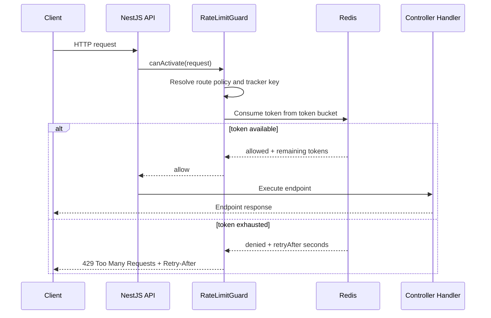
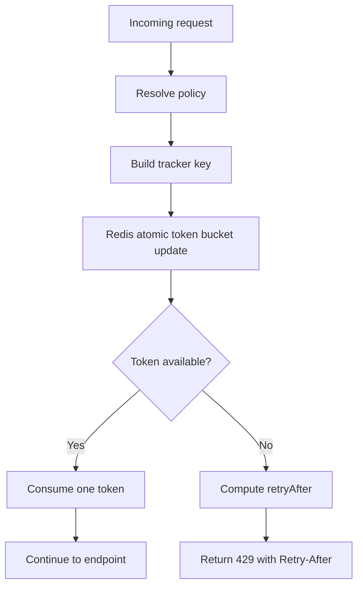

# Design: Implement Rate Limiting

## Overview

Implement rate limiting as a cross-cutting backend protection layer using Redis-backed token bucket semantics and NestJS guard integration. The guard should run globally so every request receives baseline protection, while selected routes override the default budget:

- `POST /api/registrations`: sensitive write path, max 10 requests per 10 seconds per authenticated student.
- `GET /api/workshops` and `GET /api/workshops/:id`: read-heavy browsing paths, allow at least 100 requests per minute for normal browsing.
- Other API routes: global baseline protection to limit noisy clients without changing endpoint code one by one.

Frontend work is limited to recognizing HTTP 429 responses and displaying a useful retry message in existing flows.

## Flow



## Token Bucket Behavior



The Redis update should be atomic, preferably through a Lua script or a well-tested throttler Redis storage package. The bucket stores current tokens and last refill timestamp per policy/tracker key. On each request, tokens refill according to elapsed time and policy rate, then one token is consumed if available.

## Module Mapping

- `server/src/core/rate-limiting/rate-limiting.module.ts`
  - Registers global throttling guard and rate-limit configuration.
- `server/src/core/rate-limiting/rate-limiting.guard.ts`
  - Extends or wraps NestJS throttling behavior to choose tracker keys and enforce `Retry-After`.
- `server/src/core/rate-limiting/redis-token-bucket.storage.ts`
  - Uses `RedisService` to read/update token buckets atomically.
- `server/src/core/rate-limiting/rate-limit.constants.ts`
  - Defines global, registration, and workshop-read limits.
- `server/src/app.module.ts`
  - Imports `RateLimitingModule` after `RedisModule`.
- `server/src/modules/registration/registration.controller.ts`
  - Adds route-specific throttle metadata to `POST /registrations`.
- `server/src/modules/workshop/workshop.controller.ts`
  - Adds read-heavy throttle metadata to public workshop read endpoints.
- `client/src/lib/api.ts`
  - Preserves response headers so callers can access `Retry-After`.
- `client/src/utils/errors.ts`
  - Adds a 429-aware helper that formats retry guidance.
- Existing student/workshop UI
  - Uses the helper for registration and browsing error states.

## Tracker Strategy

- Authenticated registration requests use the JWT subject as the primary tracker key: `rate:registration:user:<sub>`.
- Anonymous/public workshop read requests use IP-based tracking: `rate:workshop-read:ip:<ip>`.
- Authenticated non-registration requests may use user ID when available and IP otherwise.
- Tracker key construction must include policy name to avoid one policy consuming another policy's budget.

## Policies

| Policy | Scope | Tracker | Limit |
|---|---|---|---|
| `global` | All API routes without a more specific override | user ID when authenticated, otherwise IP | Conservative baseline budget |
| `registration-write` | `POST /api/registrations` | authenticated user ID | 10 requests / 10 seconds |
| `workshop-read` | `GET /api/workshops`, `GET /api/workshops/:id` | IP or authenticated user ID | 100 requests / minute |

The exact global baseline may be configured conservatively, but it must not override the specified registration and workshop-read requirements.

## Error Response

All rejected requests return:

- HTTP status: `429 Too Many Requests`
- Header: `Retry-After: <seconds>`
- JSON body with a stable message suitable for frontend display, for example:

```json
{
  "statusCode": 429,
  "message": "Too many requests. Please retry later.",
  "error": "Too Many Requests"
}
```

## Frontend Behavior

The shared Axios client already centralizes response handling in `client/src/lib/api.ts`. Extend existing error utilities so feature surfaces can distinguish 429 from generic failures:

- If `Retry-After` is present, show "You are making requests too quickly. Please try again in X seconds."
- If the header is missing unexpectedly, show a generic throttling message and keep the UI usable.
- Registration buttons should stop loading and remain available for retry after the delay.
- Workshop browsing should keep last successful data visible if a throttled polling/read request occurs.

## Architecture Decision Records

### ADR-1: Redis-backed token bucket instead of in-memory throttling

**Choose:** Redis-backed token bucket storage.

**Reason:** The spec requires token state in Redis for horizontally scaled backend nodes. In-memory counters would let each node grant an independent budget and would not protect the system under load-balanced traffic.

**Tradeoff:** Redis becomes part of request admission. The guard must handle Redis errors predictably and avoid long request waits.

### ADR-2: Global guard with route-specific overrides

**Choose:** Register throttling globally and annotate sensitive/read-heavy routes with explicit policies.

**Reason:** The spec requires global application with route-specific overrides. A global guard reduces the chance of new endpoints launching without traffic protection.

**Tradeoff:** Admin and background-facing endpoints need careful defaults so normal organizer workflows are not throttled too aggressively.

### ADR-3: Authenticated user tracker for registration writes

**Choose:** Use JWT `sub` for `POST /registrations` rate-limit keys.

**Reason:** Registration spam should be limited per student, not only per shared NAT/IP. This also matches the source spec's focus on clients calling registration repeatedly.

**Tradeoff:** The guard must run after enough auth context is available or decode/inspect the authenticated request consistently with existing `JwtAuthGuard`.

## Verification Strategy

- Build backend and frontend after implementation.
- Use scripted or manual repeated requests against `POST /api/registrations` to confirm the 11th request within 10 seconds returns 429.
- Confirm `Retry-After` is present and a positive integer on every 429.
- Confirm workshop browsing below 100 requests per minute succeeds.
- Confirm workshop browsing above the configured read limit returns 429 without breaking last-known frontend data.
- Confirm token state is visible in Redis and shared across separate backend processes when run locally.
