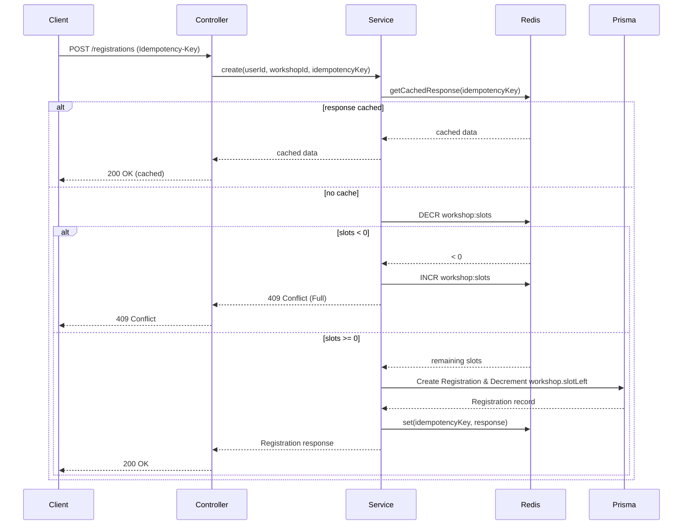

# Design: Implement Registration

## Overview

Replace the registration controller stub with a real registration flow backed by Redis for concurrency control and PostgreSQL for persistence:

- `RegistrationController` accepts `POST /registrations` and `GET /registrations/me`.
- `RegistrationService` claims slots atomically using Redis `DECR`, enforces idempotency, and records registrations in Prisma.
- `WorkshopController` and `WorkshopService` expose open workshops for users to view.
- React UI displays open workshops, capacity progress bars, handles the "Claim seat" action, and generates idempotency keys for safety.

This implements the registration capabilities and handles the constraints of high-concurrency slot booking.

## Flow

## Module Mapping

- `server/src/core/redis/redis.module.ts`
  - Provides `RedisService` to interact with the Redis instance.
- `server/src/modules/registration/registration.module.ts`
  - Provides `RegistrationService`.
- `server/src/modules/registration/registration.controller.ts`
  - Exposes `POST /registrations` and `GET /registrations/me`.
- `server/src/modules/registration/dto/create-registration.dto.ts`
  - Validates `workshopId`.
- `server/src/modules/workshop/workshop.module.ts`
  - Provides `WorkshopService`.
- `server/src/modules/workshop/workshop.controller.ts`
  - Exposes `GET /workshops`.
- `client/src/features/registration/api.ts`
  - Typed API clients for fetching workshops, registrations, and claiming slots.
- `client/src/App.tsx`
  - Renders the `StudentWorkspace` with the workshop list, slot capacity indicators, and user's confirmed registrations.

## Idempotency Strategy

- The frontend generates a unique UUID `Idempotency-Key` when the user clicks "Claim seat".
- The backend checks if the key exists in Redis cache. If it does, the backend immediately returns the cached successful response.
- If the unique constraint in PostgreSQL fails (e.g., student already registered for the workshop), the backend checks the database to see if the existing registration belongs to the current idempotency key. If it does, it returns it; otherwise, it throws a ConflictException.
- Cached idempotency responses are stored with an expiration of 24 hours.

## Slot Claiming Strategy

- Workshop slots are synced to Redis the first time a request for that workshop occurs.
- Redis `DECR` guarantees atomic decrements, preventing race conditions where multiple students claim the final slot simultaneously.
- If `DECR` drops the value below zero, the backend reverts it with `INCR` and rejects the request.
- The `Workshop` table's `slotLeft` field is also decremented within the PostgreSQL transaction, ensuring consistent long-term storage of remaining slots.

## Error Handling

- Invalid or missing `Idempotency-Key` header returns HTTP 400.
- Workshop not found returns HTTP 404.
- Workshop not open returns HTTP 409.
- Workshop full returns HTTP 409.
- Student already registered returns HTTP 409.

## Frontend UI

- Shows open workshops grouped in a grid.
- Displays a progress bar showing remaining capacity (`slotLeft` / `totalSlots`).
- "Claim seat" button is disabled if the user is already registered, if the workshop is full, or while a request is in flight.
- Shows the student's registration history and a downloadable QR code image generated by the backend.
