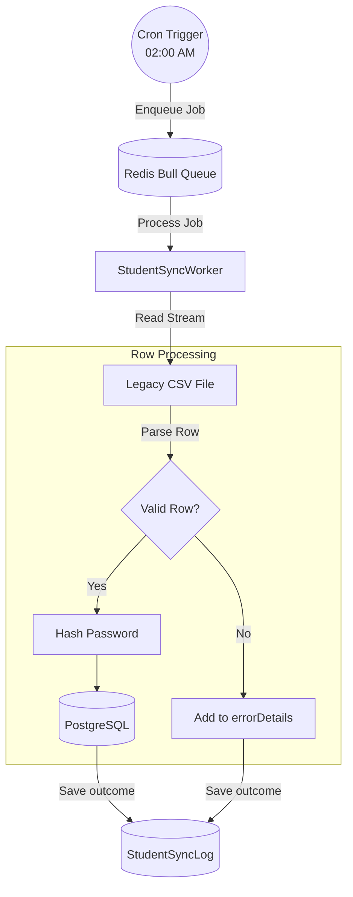

# Technical Design: Nightly Student Sync

## Overview
The student sync implementation uses a background processing pipeline. A scheduled cron job runs daily at 02:00, which dispatches a job to the Redis Bull Queue. A dedicated worker processor reads the legacy CSV file, streams through its records, and processes them sequentially or in batches. Records are updated in the PostgreSQL database using an idempotent upsert (`INSERT ... ON CONFLICT (studentId) DO UPDATE`).

## Flow Diagram



## Module Mapping

### Backend (`server/`)
- `src/modules/student-sync/student-sync.module.ts`: Wires together the `BullModule` queue registration, cron service, and Prisma. Needs `@nestjs/schedule`.
- `src/modules/student-sync/student-sync.service.ts`: Handles the `@Cron` scheduling logic, enqueuing jobs, and retrieving `StudentSyncLog` records for the frontend.
- `src/modules/student-sync/student-sync.worker.ts`: The Bull queue processor (`@Processor`). Implements `csv-parse` reading logic and loops over rows. Hashes initial passwords for new students and performs Prisma operations.
- `src/modules/student-sync/student-sync.controller.ts`: Provides `GET /admin/student-sync/logs` to list sync history, and `POST /admin/student-sync/trigger` to manually queue a sync run.

### Frontend (`client/`)
- `src/pages/organizer/StudentSyncPage.tsx`: Admin-only page. Displays a list or table of `StudentSyncLog` data. Displays error JSON in a readable format if `errors > 0`. Includes a "Run Sync Now" button calling the manual trigger endpoint.
- `src/lib/studentSyncApi.ts`: Axios API methods for the new endpoints.

## Database Additions
No new Prisma models are required, as `StudentSyncLog` is already defined in the schema.

```prisma
model StudentSyncLog {
  id           String   @id @default(cuid())
  filename     String
  totalRows    Int
  imported     Int
  errors       Int
  errorDetails Json?
  runAt        DateTime @default(now())
}
```

## Assumptions and Risks
- **Assumption:** The path to the CSV file is accessible to the NestJS server process (e.g., a mounted volume in Docker or a configurable environment variable `LEGACY_CSV_PATH`).
- **Assumption:** Passwords for newly created students will be set to a default value or randomly generated (if no password is provided in CSV).
- **Risk:** Large CSV files might consume significant memory if not streamed. *Mitigation:* Ensure `csv-parse` is used with a ReadStream rather than loading the whole file into memory at once.
- **Verification:** Unit tests to mock the CSV file and verify correct `StudentSyncLog` creation. Manually upload/place a malformed CSV and assert that the valid rows are created while the malformed rows are skipped and logged.
