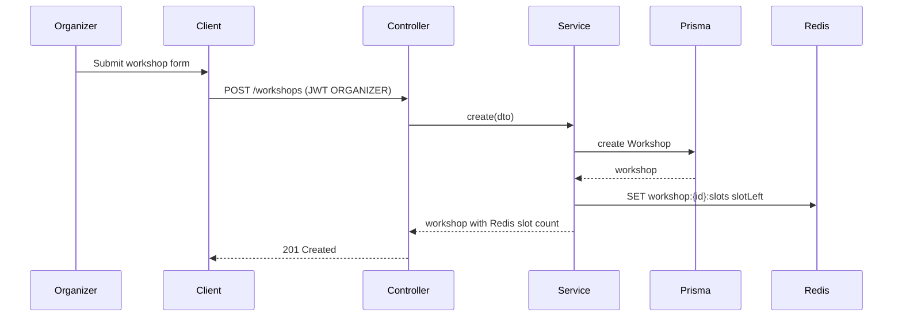
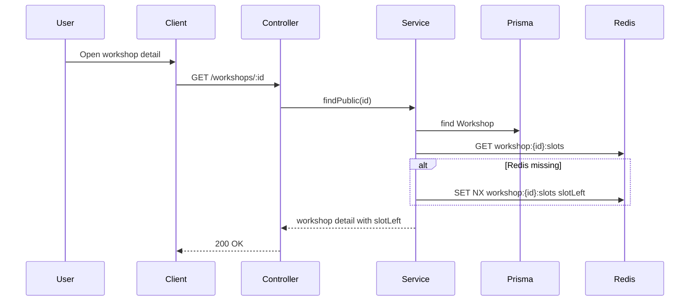
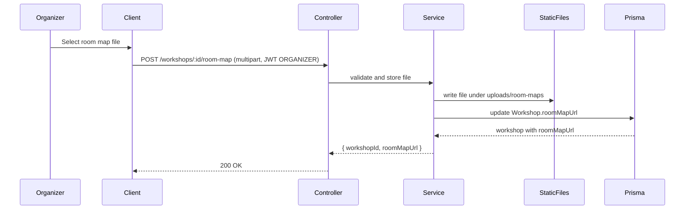
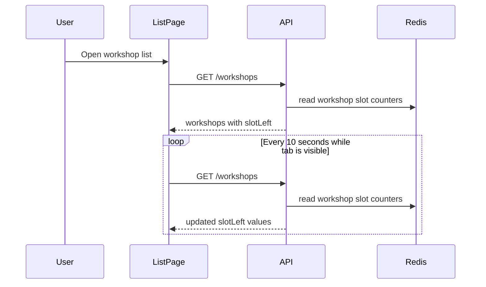

# Design: Implement Workshop Management

## Overview

Complete the `WorkshopModule` as the source of truth for workshop schedule management while keeping slot display fast through Redis. PostgreSQL remains canonical for workshop data; Redis stores the available-slot read model used by public lists, details, and registration.

The implementation should preserve the existing public `GET /workshops` behavior and add detail and organizer mutation endpoints. Mutations require `JwtAuthGuard`, `RolesGuard`, and `@Roles(Role.ORGANIZER)`.

The required frontend surface includes a public workshop list with slot polling, a mandatory workshop detail page, and an organizer workshop form that can attach a room map by uploading an image/PDF or by saving an existing room map URL.

## Flow

## Module Mapping

- `server/src/modules/workshop/workshop.controller.ts`
  - Keep public `GET /workshops`.
  - Add public `GET /workshops/:id`.
  - Keep organizer `GET /workshops/admin`.
  - Add organizer-only mutation endpoints.
  - Add organizer-only `POST /workshops/:id/room-map` using a multipart file interceptor.
- `server/src/modules/workshop/workshop.service.ts`
  - Add create, update, find detail, and status transition methods.
  - Centralize Redis slot key and slot hydration logic.
  - Validate capacity changes against confirmed registrations.
  - Validate room map files, write them to the configured upload directory, and persist `roomMapUrl`.
- `server/src/modules/workshop/dto/`
  - Add `CreateWorkshopDto`, `UpdateWorkshopDto`, and `UpdateWorkshopStatusDto`.
- `client/src/lib/workshopsApi.ts`
  - Add typed organizer CRUD calls, public list/detail calls, slot polling support through the existing list endpoint, and room map upload call.
- `client/src/pages/organizer/WorkshopsPage.tsx`
  - Replace AI-summary-only layout with workshop list, create/edit form, room map file input or URL field, status controls, and AI summary upload as one operation inside each workshop row.
- `client/src/pages/student/StudentWorkspace.tsx`
  - Keep the public workshop list, add navigation to detail pages, and poll `GET /workshops` for updated Redis slot counts while visible.
- `client/src/pages/student/WorkshopDetailPage.tsx`
  - Add mandatory route-level detail page for `GET /workshops/:id`.

## Slot Counter Strategy

- On workshop create, set Redis `workshop:{id}:slots` to `slotLeft`.
- On public list/detail, initialize a missing Redis key with `SET NX` using canonical `slotLeft`.
- On capacity updates:
  - Reject `totalSlots` values below the number of non-cancelled registrations.
  - Compute new `slotLeft` from `newTotalSlots - activeRegistrationCount`.
  - Persist `totalSlots` and `slotLeft` in PostgreSQL.
  - Replace the Redis slot key with the computed `slotLeft`.
- Status transitions must not hard delete records. Cancellation sets `status = CANCELLED`; completion sets `status = COMPLETED`.

## Room Map Upload Strategy

- Endpoint: `POST /workshops/:id/room-map`.
- Access: requires `JwtAuthGuard`, `RolesGuard`, and `@Roles(Role.ORGANIZER)`.
- Request: multipart form data with field name `file`.
- Accepted file types: PNG, JPEG, WebP, SVG, or PDF.
- Max size: 5 MB.
- Validation: check MIME type, file extension, and file signature where practical. Reject missing files, unsupported types, and oversized files with HTTP 400.
- Storage: write files under a server-local upload directory such as `server/uploads/room-maps`. Generate collision-resistant filenames and do not trust the original filename for the stored path.
- Serving: expose uploaded room maps through a static route such as `/api/uploads/room-maps/<filename>` or another documented public static URL.
- Persistence: update the existing `Workshop.roomMapUrl` field with the served URL.
- Response: return `{ workshopId, roomMapUrl }` and enough workshop data for the admin form to update without a full reload.
- Create/edit forms may also accept a manually entered `roomMapUrl`; uploaded files replace that value after successful upload.

## Slot Polling Strategy

- The public workshop list page polls `GET /workshops` every 10 seconds while the browser tab is visible.
- Polling uses the existing list endpoint as the refresh source; the backend continues to hydrate `slotLeft` from Redis.
- Polling pauses when `document.visibilityState !== 'visible'` and resumes immediately when the tab becomes visible.
- Polling errors keep the last successful slot counts on screen and show a non-blocking refresh warning instead of clearing the list.
- Registration success still applies the existing optimistic local decrement, and the next poll reconciles with Redis.
- The detail page may refresh when opened and after registration actions, but continuous polling is required only for the list page.

## API Shape

- `GET /workshops`: public list of `OPEN` workshops with Redis slot count.
- `GET /workshops/:id`: public detail for a visible workshop with Redis slot count.
- `GET /workshops/admin`: organizer list of all statuses with Redis slot count.
- `POST /workshops`: organizer creates draft or open workshop.
- `PATCH /workshops/:id`: organizer edits schedule, content, room, pricing, and capacity.
- `PATCH /workshops/:id/status`: organizer transitions between `DRAFT`, `OPEN`, `CANCELLED`, and `COMPLETED` when valid.
- `POST /workshops/:id/room-map`: organizer uploads a room map file and receives the persisted `roomMapUrl`.

## Validation

- `title`, `description`, `speaker`, `room`, `startTime`, and `endTime` are required for creation.
- `endTime` must be after `startTime`.
- `totalSlots` must be a positive integer.
- `price` must be zero for free workshops and positive for paid workshops.
- `roomMapUrl` must be either empty, a valid URL/path returned by the upload API, or a valid organizer-entered URL.
- Uploaded room maps must be one of the accepted file types and 5 MB or smaller.
- Capacity cannot be reduced below active registrations.
- Cancelled workshops cannot be reopened unless the implementation explicitly supports and validates that transition.

## ADR: WorkshopModule Owns Schedule State

Workshop creation and status changes should remain in `WorkshopModule`, not registration or AI summary modules.

Reasoning:
- Workshop data is the upstream dependency for registration, payment, check-in, and AI summary.
- Keeping Redis slot initialization in one module avoids duplicated slot-key logic across unrelated features.
- Registration still owns atomic slot claims with Redis `DECR`; workshop management owns administrative capacity changes.

Tradeoff:
- Capacity edits must coordinate with registration records, so `WorkshopService` needs a focused registration-count query.
